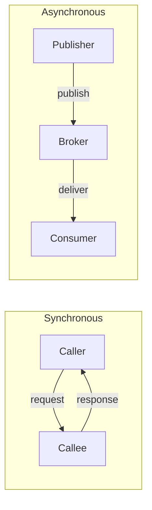
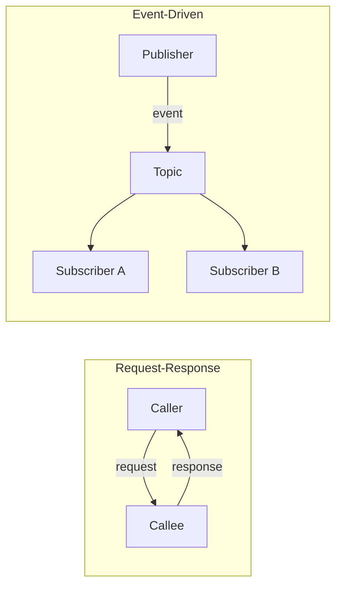

# Chapter 4: Microservice Communication Styles

*Building Microservices*, 2nd Edition — Sam Newman

**In a nutshell:** How your microservices talk to each other matters as much as *what* they do. This chapter steps back from specific tech (HTTP, Kafka, gRPC) and looks at *communication styles*: synchronous vs asynchronous, request-response vs event-driven, and when sharing data through a common store makes sense. Get the style right for your problem, then pick the technology that fits it.

---

## Why Communication Style Matters

You’ve probably seen it before. Someone says, “We’ll use REST between all our services,” or “Let’s put everything on Kafka.” Nothing wrong with REST or Kafka in themselves—but the right choice really depends on *what kind* of conversation you need. If you pick the tech first and only later figure out that you needed something different, you end up with awkward workarounds or a big rewrite.

Newman’s point in this chapter is to separate *style* from *implementation*. Before you reach for HTTP or a message broker, ask yourself: Does the caller need an answer right now, or can it wait? Should one thing trigger many listeners, or is it a straight one-to-one request? How much can we tolerate things being slow or failing in the middle? Once you’re clear on that, the technology choice becomes a lot easier. So we’re not picking a protocol here; we’re building a mental model of the options and their trade-offs so you can have a sensible conversation with your team—and with your future self.

---

## From In-Process to Inter-Process

When you call a method in the same process, life is simple. Same memory, same failure domain, and the call is effectively instant. It’s really tempting to think of a microservice call as “just” another method call, only over the network. But here’s the thing: the moment you cross a process boundary, you’re in a different world.

Across the network you get **latency**—every hop costs time, and it adds up. You get **partial failure**—the other process might be slow, crashed, or the network might drop your request without telling you. You get **serialization**—you’re sending bytes, not passing pointers, so everything has to be turned into something that can travel on the wire. And you get **versioning**—the caller and the callee can change and deploy independently, so you have to think about compatibility.

If you ignore all that and treat a remote call like a local method call, you’ll run into trouble: cascading timeouts (one slow service blocks everyone waiting on it), thread exhaustion (all your threads stuck waiting on the network), and systems that fall over in surprising ways. So the first step is to accept that a call to another service is *not* like a method call—and to design for latency and failure from day one.

**Example.** Imagine your Order Service calls the Payment Service over HTTP. In your head it might feel like `paymentService.charge(order)`. But that HTTP call can take 50 ms or 5 seconds or never return. The network can drop the response after the payment was actually taken. The Payment Service might roll out a new version that changes the request format. None of that happens when you call a method in the same process. So you need timeouts, retries, and a plan for “what if I never get a response?”

---

## Synchronous Blocking Communication

**Synchronous blocking** means the caller sends a request and **waits** until the response comes back—or until a timeout. You don’t do anything else in between; you’re blocked. Classic examples are HTTP REST and gRPC: one request, one response on the same logical connection.

You use it when the caller genuinely needs the result to continue. For example: “Give me this user’s profile so I can render the dashboard,” or “Reserve this inventory and tell me yes or no so I can show the customer whether the item is available.” The upside is simplicity: straightforward request–response, immediate feedback, and easier debugging (one call, one outcome). The downside is **coupling**: the caller depends on the callee’s availability and speed. If the callee is slow or down, the caller sits there waiting. Without timeouts and circuit breakers, one bad dependency can tie up threads and drag down the whole chain. So sync blocking fits fast, usually-available operations where the client needs the answer right away.

**Examples.**

- **Get user profile.** The front end needs the user’s name and preferences to render the page. Sync makes sense: you call the User Service, wait for the response, then render. The user is already waiting for the page; a quick round-trip is fine.
- **Check inventory.** On the product page you want to show “In stock” or “Only 2 left.” You call the Inventory Service, get the count, display it. Again, the user is waiting; you need the answer in that same request.
- **Validate and reserve.** During checkout you might call Inventory to reserve items and Payment to authorize the card. If you need to tell the user “Order confirmed” or “Sorry, out of stock” in one go, you’re in sync territory—but you’d better have short timeouts and maybe a circuit breaker, because now you’re chaining several services and the slowest one sets the pace.

---

## Asynchronous Nonblocking Communication

**Asynchronous nonblocking** means the caller sends a message and **does not wait** for the full result. At most it gets an acknowledgment or a correlation id. The actual outcome might arrive later—via a callback, by the client polling an API, or through another event.

In practice you often use a message broker (RabbitMQ, Kafka, Azure Service Bus, etc.): the producer publishes a message and moves on; the consumer(s) process it when they can. The upside is **decoupling** and **resilience**: the producer isn’t blocked by the consumer’s speed or availability, and messages can sit in a queue until someone is ready. You also get **fan-out**: one event can trigger many subscribers. The downside is extra moving parts—broker, ordering, retries, idempotency—and you have to design how the client gets the result (polling, webhook, or correlation id). Async fits long-running work, high throughput, and flows where you’re okay with “accepted; I’ll tell you when it’s done.”

**Examples.**

- **Order confirmation email.** When an order is placed, you don’t need to wait for the email to be sent before responding to the user. The Order Service publishes “OrderPlaced”; the Notification Service consumes it and sends the email whenever it gets to it. The user sees “Order confirmed” immediately; the email arrives a few seconds later. If the email service is slow or down, the order is still recorded and the message waits in the queue.
- **Video processing.** User uploads a video; you return “Upload complete, we’re processing it.” A separate service picks up the job from a queue, transcodes the video, and when it’s done it might publish “VideoReady” or update a status that the client can poll. Sync would be a bad fit here—you’d hold the connection open for minutes and risk timeouts.
- **Fan-out.** One “OrderPlaced” event can be consumed by Inventory (reserve stock), Payment (charge the card), Notifications (send email), and Analytics (update dashboards). You didn’t call four services one by one; you published one event and each subscriber does its thing. Add a new subscriber later without changing the Order Service.

---

## Communication Through Common Data

Another style is **communication through common data**: multiple services read or write the same data store (a database or a cache). There’s no direct “call” from A to B; they coordinate by reading and updating shared state.

Sometimes that’s convenient—for example, a read-only cache of reference data (country codes, product categories) that several services need. The upside can be simplicity and fast reads. The downside is **coupling** and **ownership**: who owns the schema? Who can change it? If the Inventory Service and the Reporting Service both depend on the same tables, every schema change becomes a coordination problem. You also risk consistency issues: one service might see stale data or assume a layout that another service changes. So this style is worth considering for reference data or reporting-style reads, but it can create real problems when used as the *main* way services collaborate. In a microservice world, you usually want clear ownership of data per service and explicit communication (sync or async) rather than leaning on a shared database as the primary integration mechanism.

**Examples.**

- **Reference data.** A small “countries” or “currencies” table that many services read. If one team owns it and publishes a feed or API, others consume it. Sharing the same database for that can be okay if the contract is stable and everyone agrees who changes it.
- **Reporting / analytics.** A data warehouse or replica that multiple services write to (or that slurps from their events). The key is that the warehouse isn’t the source of truth for the core workflow; it’s a consumer. The core workflow still uses explicit sync or async communication.
- **What to avoid.** Don’t have Order Service and Payment Service both writing to the same “orders” table and expecting to coordinate that way. You lose clear ownership, and every change becomes a cross-service migration. Prefer one service that owns the order and exposes an API or events.

---

## Request-Response: Sync vs Async

**Request-response** is a *pattern*: one party asks, the other answers. It can be implemented in two ways.

**Synchronously:** one call, one response on the same channel (e.g. HTTP). The caller blocks until the response arrives. Good when the caller needs the result immediately and the operation is fast. Example: “GET /users/123” — you wait, you get the user.

**Asynchronously:** the request is sent as a message (e.g. “create order”); the response comes later. Maybe the client polls `GET /orders/456` until the status is “completed” or “failed.” Maybe the service calls back to a webhook. Maybe it publishes an “OrderCompleted” event that the client (or another service) subscribes to. Good when the operation is long-running or you want the request path to return quickly with “accepted” and then notify or allow polling later. Example: “Submit this job” → you get back a job id → you poll “GET /jobs/789” until it’s done.

So “request-response” doesn’t force you into sync or async; you choose based on whether the client needs the answer in the same round-trip or can wait.

**Example.** “Place order” can be done both ways. *Sync:* The client calls the API; the backend calls Inventory and Payment and only when both succeed does it return “Order confirmed.” The client waits for the whole thing. *Async:* The client calls the API; the backend creates the order, publishes “OrderPlaced,” and immediately returns “Order accepted, id = 456.” The client then polls “GET /orders/456” or gets a webhook when the order is fully processed. Same “request-response” idea—ask for an order, get a result—but different timing and different resilience characteristics.

---

## Event-Driven Collaboration

In **event-driven** collaboration, services react to **events**—things that happened—rather than direct requests. Nobody says “Inventory Service, reserve this”; instead, someone publishes “OrderPlaced” and whoever cares (inventory, payments, notifications) reacts. There’s no single point-to-point request; it’s one-to-many or many-to-many.

This goes hand-in-hand with asynchronous messaging: events are usually published to a broker and consumed asynchronously. You get loose coupling (publishers don’t know or care who subscribes), fan-out (many consumers from one event), and a model that fits eventual consistency. The trade-off is less obvious control flow and the need to think about ordering, duplicates, and idempotency. Event-driven fits well when multiple services need to react to the same occurrence or when you want to add new reactions without changing the producer.

**Examples.**

- **OrderPlaced.** One event, many subscribers: reserve inventory, charge payment, send confirmation email, update analytics, notify the warehouse. The Order Service doesn’t know the full list; it just publishes. You add a new “send to loyalty program” subscriber without touching the Order Service.
- **UserSignedUp.** Auth service publishes it; Notification Service sends a welcome email, Analytics Service counts signups, maybe a Marketing Service adds the user to a campaign. Again, the publisher doesn’t call each of these; it just says “this happened.”
- **Contrast with request-response.** In request-response, someone is explicitly asking someone else to do something. In event-driven, someone is saying “this happened” and others react if they care. So you get less coupling but also less obvious “who does what next”—you have to design the flow with events and possibly sagas or choreography.

---

## Choosing the Right Style

So when do you use what?

- **Need the result immediately** and the operation is short and usually fast? Prefer **synchronous request-response** (e.g. HTTP/gRPC), and protect it with timeouts and circuit breakers. Think: “Get user profile,” “Check stock,” “Validate coupon.”
- **Long-running** work, or you want **resilience** and **fan-out**? Prefer **asynchronous** messaging and **event-driven** flows; design how the client gets the outcome (polling, callback, or events). Think: “Send email,” “Process video,” “Notify everyone who cares about this order.”
- **Shared reference or reporting data**? **Common data** can be acceptable if boundaries and ownership are clear, but don’t use it as the main integration style between core services. Think: “Read-only reference table” or “data warehouse,” not “shared database for the core order flow.”

In practice you’ll use a **mix**. The same system might have sync calls for “get order by id” and async events for “order placed, notify everyone.” One user journey might involve both: sync to check inventory and reserve, then async to send the confirmation email and update analytics. The chapter gives you the vocabulary and trade-offs so you can choose deliberately—and explain your choices to others—instead of defaulting to one style for everything.

---

## Summary and Further Reading

- **Separate style from tech.** Decide whether you need sync or async, request-response or event-driven, before locking in a protocol or broker.
- **Inter-process is not in-process.** Design for latency and partial failure; don’t treat remote calls like local method calls.
- **No single “right” style.** Use synchronous request-response when the client needs an immediate result; use async and events for resilience, fan-out, and long-running work; use common data sparingly and with clear ownership.

**Further reading**

- *Building Microservices*, 2nd Edition, Sam Newman — Chapter 4 (full chapter).
- [Sync vs Async Messaging](../docs/12-sync-vs-async-messaging.md) — implementation-focused guide in this repo.
- [Saga Pattern](../docs/06-saga-pattern.md) — orchestration vs choreography (sync vs event-driven coordination).
