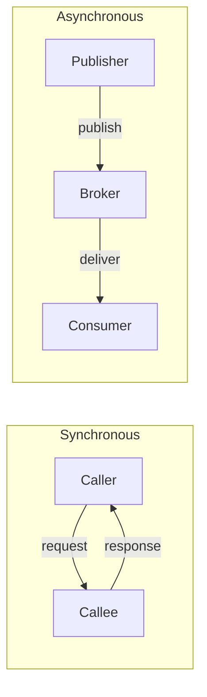
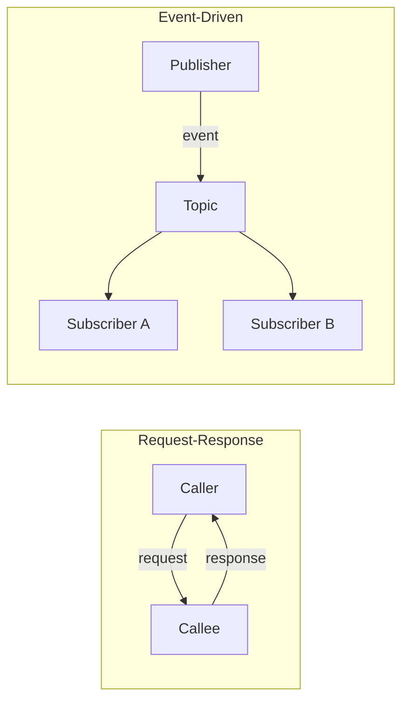

# Chapter 4: Microservice Communication Styles

*Building Microservices*, 2nd Edition — Sam Newman

**In a nutshell:** How your microservices talk to each other matters as much as *what* they do. This chapter steps back from specific tech (HTTP, Kafka, gRPC) and looks at *communication styles*: synchronous vs asynchronous, request-response vs event-driven, and when sharing data through a common store makes sense. Get the style right for your problem, then pick the technology that fits it.

---

## Why Communication Style Matters

It’s easy to jump straight to a technology. “We’ll use REST between services.” Or “Let’s put everything on Kafka.” The catch is that the right choice depends on *what kind* of communication you need—and many teams choose the tech first and only later run into mismatches.

Newman’s point in this chapter is simple but powerful: separate *style* from *implementation*. Think about whether the caller needs an immediate response, whether multiple services should react to the same thing, and how much you can tolerate latency and failure. Once you’re clear on that, you can sensibly choose HTTP, gRPC, a message broker, or something else. So we’re not picking a protocol here; we’re building a mental model of the options and their trade-offs.

---

## From In-Process to Inter-Process

When you call a method in the same process, you’re in a cozy world: same memory, same failure domain, and the call is effectively instantaneous. It’s tempting to imagine a microservice call as “just” another method call over the network. But inter-process communication is fundamentally different.

Across the network you get **latency** (every hop costs time), **partial failure** (the other process might be slow, down, or the network might drop your request), **serialization** (you’re sending bytes, not in-memory references), and **versioning** (caller and callee can change independently). If you ignore that and treat a remote call like a local one, you’ll run into cascading timeouts, thread exhaustion, and brittle systems. So the first step is to accept that a call to another service is not like a method call—and design for latency and failure from the start.

---

## Synchronous Blocking Communication

**Synchronous blocking** means the caller sends a request and **waits** until the response comes back (or a timeout). Classic examples are HTTP REST and gRPC: one request, one response on the same logical connection.

You use it when the caller genuinely needs the result to continue—for example, “get this user’s profile” or “reserve inventory and tell me if it succeeded.” The upside is simplicity: straightforward request-response, immediate feedback, and easier debugging (one call, one outcome). The downside is **coupling**: the caller depends on the callee’s availability and speed. If the callee is slow or down, the caller blocks. Without timeouts and circuit breakers, one bad dependency can tie up threads and drag down the whole chain. So sync blocking fits fast, usually-available operations where the client needs the answer right away.

---

## Asynchronous Nonblocking Communication

**Asynchronous nonblocking** means the caller sends a message and **does not wait** for the full result—at most it gets an acknowledgment or a correlation id. The actual outcome might arrive later via a callback, a polled API, or another event.

Typical implementations use a message broker (e.g. RabbitMQ, Kafka, Azure Service Bus): the producer publishes a message and moves on; the consumer(s) process it when they can. The upside is **decoupling** and **resilience**: the producer isn’t blocked by the consumer’s speed or availability, and messages can wait in a queue. You also get **fan-out**: one event can trigger many subscribers. The downside is extra moving parts—broker, ordering, retries, idempotency—and you have to design how the client gets the result (polling, webhook, or correlation id). Async fits long-running work, high throughput, and flows where you’re okay with “accepted, I’ll tell you when it’s done.”

---

## Communication Through Common Data

Another style is **communication through common data**: multiple services read or write the same data store (database or cache). There’s no direct “call” from A to B; they coordinate by reading and updating shared state.

The upside can be simplicity for read-heavy or reference data. The downside is **coupling** and **ownership**: who owns the schema? Who can change it? You also risk tight coupling and consistency issues if services start depending on each other’s data layout. So this style is worth considering for reference data or reporting-style reads, but it can create problems when used as the main way services collaborate. In a microservice world, you usually want clear ownership of data per service and explicit communication (sync or async) rather than leaning on a shared database as the primary integration mechanism.

---

## Request-Response: Sync vs Async

**Request-response** is a *pattern*: one party asks, the other answers. It can be implemented in two ways.

**Synchronously:** one call, one response on the same channel (e.g. HTTP). The caller blocks until the response arrives. Good when the caller needs the result immediately and the operation is fast.

**Asynchronously:** the request is sent as a message (e.g. “create order”); the response comes later via another message, callback, or the client polling something like `GET /orders/{id}`. Good when the operation is long-running or you want the request path to return quickly with “accepted” and then notify or allow polling later.

So “request-response” doesn’t force you into sync or async; you choose based on whether the client needs the answer in the same round-trip or can wait.

---

## Event-Driven Collaboration

In **event-driven** collaboration, services react to **events** (things that happened) rather than direct requests. No one says “Inventory Service, do this”; instead, someone publishes “OrderPlaced” and any number of subscribers—inventory, payments, notifications—react. There’s no single point-to-point request; it’s one-to-many or many-to-many.

This goes hand-in-hand with asynchronous messaging: events are usually published to a broker and consumed asynchronously. You get loose coupling (publishers don’t know or care who subscribes), fan-out (many consumers from one event), and a model that fits eventual consistency. The trade-off is less obvious control flow and the need to think about ordering, duplicates, and idempotency. Event-driven fits well when multiple services need to react to the same occurrence or when you want to add new reactions without changing the producer.

---

## Choosing the Right Style

So when do you use what?

- **Need the result immediately** and the operation is short and usually fast? Prefer **synchronous request-response** (e.g. HTTP/gRPC), and protect it with timeouts and circuit breakers.
- **Long-running** work, or you want **resilience** and **fan-out**? Prefer **asynchronous** messaging and **event-driven** flows; design how the client gets the outcome (polling, callback, or events).
- **Shared reference or reporting data**? **Common data** can be acceptable if boundaries and ownership are clear, but don’t use it as the main integration style between core services.

In practice you’ll use a **mix**. The same system might have sync calls for “get order by id” and async events for “order placed, notify everyone.” The chapter gives you the vocabulary and trade-offs so you can choose deliberately instead of defaulting to one style for everything.

---

## Summary and Further Reading

- **Separate style from tech:** Decide whether you need sync or async, request-response or event-driven, before locking in a protocol or broker.
- **Inter-process is not in-process:** Design for latency and partial failure; don’t treat remote calls like local method calls.
- **No single “right” style:** Use synchronous request-response when the client needs an immediate result; use async and events for resilience, fan-out, and long-running work; use common data sparingly and with clear ownership.

**Further reading**

- *Building Microservices*, 2nd Edition, Sam Newman — Chapter 4 (full chapter).
- [Sync vs Async Messaging](../docs/12-sync-vs-async-messaging.md) — implementation-focused guide in this repo.
- [Saga Pattern](../docs/06-saga-pattern.md) — orchestration vs choreography (sync vs event-driven coordination).
