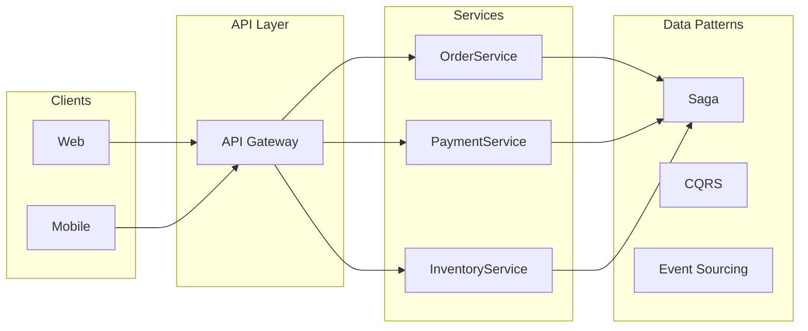
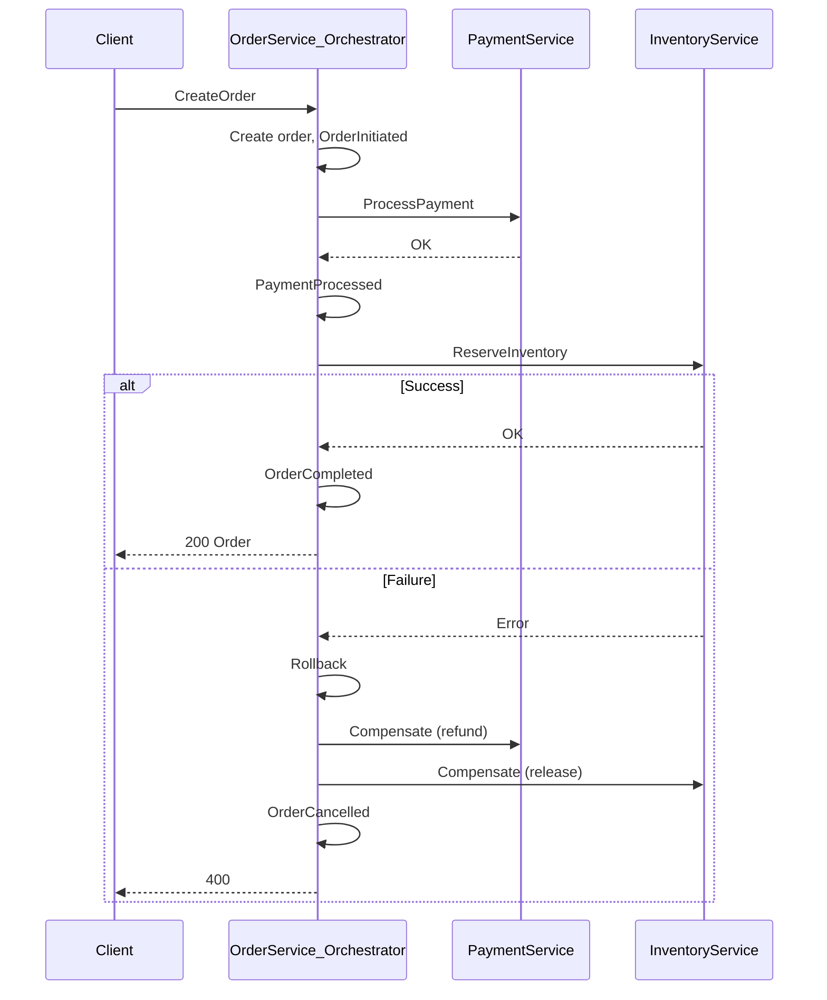

# Microservices Patterns: A Comprehensive Guide

## Introduction

Microservices patterns are reusable solutions to common design and operational challenges when building systems as a set of small, autonomous services. They address decomposition, data consistency, communication, reliability, and integration so that you can scale teams and systems without ending up with a distributed monolith.

This document explains the **main** patterns with **use cases**, **why** to use them, **practical scenarios**, and **implementation in .NET**. It is intended for architects and developers studying or implementing microservice systems. The repository includes a **Saga orchestration** sample in [orchestration/Sagas.Orchestration](orchestration/Sagas.Orchestration): OrderService coordinates Payment and Inventory over HTTP, with order states and a rollback stub—that flow is referenced throughout the Saga section.

---

## Pattern Categories and Where They Apply

| Category | Patterns |
|----------|----------|
| **Architecture & decomposition** | Microservice architecture, Decompose by business capability, Decompose by subdomain, Strangler application |
| **Data & consistency** | Database per service, Saga, CQRS, Event sourcing, API composition, Domain events |
| **Communication & API** | API Gateway, Sync vs async messaging, Idempotent consumer |
| **Reliability** | Circuit breaker |
| **Transactional messaging** | Transactional outbox |

---

## Architecture & Decomposition

### Microservice Architecture

**What it is**

Microservice architecture structures an application as a collection of loosely coupled, independently deployable services. Each service is built around a bounded context, owns its data, and communicates via well-defined APIs or events. The alternative is a monolithic architecture: one deployable unit with shared database and codebase.

**Use cases**

- Systems that need to scale development across multiple teams.
- Domains with different scaling, availability, or technology needs per area.
- Organizations moving from monoliths and willing to accept operational complexity in exchange for flexibility.

**Why use it**

- **Independent deployment**: Deploy one service without redeploying others.
- **Technology diversity**: Use the right stack per service (e.g. .NET for one, different DB for another).
- **Fault isolation**: A failing service can be contained with circuit breakers and bulkheads.
- **Team ownership**: Teams can own full lifecycle of their services.

**Practical scenarios**

- E-commerce: separate services for orders, payments, inventory, and notifications, each scaled and released independently.
- Multi-tenant SaaS: core platform vs tenant-specific or region-specific services.

**Implementation in .NET**

- One solution per service or a solution with multiple service projects; each service has its own `Program.cs`, host, and config.
- Use minimal APIs or ASP.NET Core Web API; keep services small and focused. This repo’s [OrderService](orchestration/Sagas.Orchestration/OrderService), [PaymentService](orchestration/Sagas.Orchestration/PaymentService), and [InventoryService](orchestration/Sagas.Orchestration/InventoryService) are examples of separate deployable services.

---

### Decompose by Business Capability

**What it is**

Services are defined by business capabilities (e.g. “Order management”, “Payment”, “Inventory”) rather than technical layers. Each capability maps to a team and a service boundary, aligning code structure with how the business works.

**Use cases**

- Greenfield microservice systems.
- Monoliths being split by business function.
- Organizations that organize teams by business domain.

**Why use it**

- Clear ownership and boundaries.
- Changes stay localized to one capability.
- Easier to reason about consistency and transactions within a capability.

**Practical scenarios**

- Order management (create, update, cancel orders), Payment (charge, refund), Inventory (reserve, release, adjust). This repo’s Order, Payment, and Inventory services follow this idea.

**Implementation in .NET**

- One or more projects per capability; each exposes HTTP or message endpoints. Identify capabilities from business processes (e.g. “fulfil order” involves order, payment, inventory) and assign each to a service.

---

### Decompose by Subdomain (DDD)

**What it is**

Decomposition is driven by Domain-Driven Design (DDD): subdomains (core, supporting, generic) and bounded contexts. Services align with bounded contexts, each with its own ubiquitous language and model.

**Use cases**

- Complex domains where precise language and boundaries matter.
- Systems with distinct core vs supporting functionality.
- When you want to avoid one shared “god” model across the system.

**Why use it**

- Boundaries reflect the domain, not just technical layers.
- Reduces coupling and clarifies where consistency and transactions apply.
- Supports strategic design (core vs supporting subdomains).

**Practical scenarios**

- Core subdomain: “Order fulfilment” (order + payment + inventory coordination). Supporting: “Notifications”, “Reporting”. Generic: “Identity”, “Billing”.

**Implementation in .NET**

- Use DDD building blocks (aggregates, entities, value objects, domain events) inside each service. Keep separate NuGet or projects per bounded context; avoid sharing domain models across services (use DTOs or events at boundaries).

---

### Strangler Application

**What it is**

Incremental migration from a monolith to microservices by “strangling” the monolith: new functionality goes into new services, and existing functionality is gradually replaced by calls to those services or rewritten in place. The monolith shrinks over time.

**Use cases**

- Migrating a large monolith without a risky big-bang rewrite.
- When you need to deliver value while migrating.
- When the monolith cannot be replaced in one release.

**Why use it**

- Reduces risk; you migrate one capability at a time.
- Allows learning and tuning the new architecture before full cutover.
- Business continues on the monolith while new features use microservices.

**Practical scenarios**

- Replace “create order” in the monolith with a facade that calls the new OrderService; later move read paths and then retire the monolith’s order module.

**Implementation in .NET**

- API Gateway or reverse proxy (e.g. YARP) routes selected paths to new services; other paths still hit the monolith. Use feature flags or routing rules to switch traffic. Anti-corruption layer in the new service translates between monolith and service models.

---

## Data & Consistency

### Database per Service

**What it is**

Each microservice has its own private database (or schema). No other service accesses that database directly; all access is through the service’s API or events. This enforces loose coupling and allows each service to choose the right storage technology.

**Use cases**

- Any microservice system that aims for true service autonomy.
- When different services need different storage (e.g. relational vs document vs cache).

**Why use it**

- Loose coupling: schema changes in one service don’t break others.
- Technology flexibility: SQL for one service, NoSQL for another.
- Clear ownership and consistency boundaries.

**Practical scenarios**

- OrderService has an orders DB, PaymentService a payments DB, InventoryService an inventory DB. No cross-database joins; data is combined via APIs or events (e.g. Saga, API composition).

**Implementation in .NET**

- Each service project has its own DbContext (EF Core) or repository and connection string. Never reference another service’s DbContext or DB. Use migrations per service. In this repo, each service would maintain its own store (e.g. OrderRepository in OrderService).

---

### Saga

**What it is**

A Saga maintains data consistency across services without distributed (2PC) transactions. It is a sequence of **local transactions**, each in one service. If a step fails, **compensating transactions** undo previous steps. There are two styles: **orchestration** (a central coordinator invokes participants and drives rollback) and **choreography** (services react to events and run local logic and compensations without a central coordinator).

**Use cases**

- Multi-step business processes that span services (e.g. place order → reserve inventory → charge payment → ship).
- When you need eventual consistency and cannot use a single database transaction.

**Why use it**

- Avoids distributed locks and 2PC while still preserving business consistency.
- Allows each service to keep its own data and transactional boundaries.

**Practical scenarios**

- **Order fulfilment**: Create order (OrderService) → Process payment (PaymentService) → Reserve inventory (InventoryService). On any failure, compensate: refund payment, release inventory, mark order cancelled. This matches the flow in this repo’s OrderService.

**Implementation in .NET**

- **Orchestration**: A coordinator (e.g. OrderService) holds saga state and calls participants in sequence; on failure it invokes compensating actions in reverse order. In this repo, [OrdersController.CreateOrder](orchestration/Sagas.Orchestration/OrderService/Controllers/OrdersController.cs) is the orchestrator: it creates the order, calls Payment then Inventory via HTTP, and on exception calls `Rollback(order)` and sets status to `OrderCancelled`. States are expressed in [OrderStatus](orchestration/Sagas.Orchestration/OrderService/Enumerations/OrderStatus.cs): `OrderInitiated` → `PaymentProcessed` → `InventoryReserved` → `OrderCompleted` (or `OrderCancelled`). For production, implement real compensations in `Rollback` (e.g. call PaymentService to refund, InventoryService to release) and consider persisting saga state and using idempotency keys.
- **Choreography**: Services publish and subscribe to domain events (e.g. OrderCreated, PaymentCompleted, InventoryReserved). No single coordinator; each service runs its local transaction and publishes the next event or a compensation event. Use a message broker (e.g. RabbitMQ, Azure Service Bus) and ensure consumers are idempotent.
- **Libraries**: MassTransit has saga support (state machines, persistence). Durable Task Framework can orchestrate steps and compensations. For HTTP-based orchestration like in this repo, improve with retries (Polly), health checks, and explicit compensation API endpoints on Payment and Inventory services.

---

### CQRS (Command Query Responsibility Segregation)

**What it is**

Read and write operations are separated. The write side (command model) updates the domain and persistence; the read side (query model) uses one or more read-optimized stores (e.g. materialized views, denormalized tables). Often used with event sourcing: writes append events; reads are served from projections.

**Use cases**

- High read or write throughput with different shapes (e.g. complex queries vs simple writes).
- When read and write consistency requirements differ (e.g. eventual consistency for reads).
- Reporting, dashboards, or search that must not impact write path performance.

**Why use it**

- Scale and optimize read and write independently.
- Use the right storage for each (e.g. relational for commands, document or search for queries).
- Clear separation of concerns and simpler models per side.

**Practical scenarios**

- Order service: commands (CreateOrder, CancelOrder) write to event store or primary DB; queries (GetOrderHistory, GetDashboard) read from a separate read store or materialized view updated from events.

**Implementation in .NET**

- **Commands**: MediatR handlers, or dedicated command handlers, that validate and persist. **Queries**: Separate query handlers and read models (e.g. Dapper, EF read-only, or a separate read service). For event-sourced writes, project events into read models (e.g. in a background worker or message handler). Microsoft’s [simplified CQRS/DDD guidance](https://learn.microsoft.com/en-us/dotnet/architecture/microservices/microservice-ddd-cqrs-patterns/apply-simplified-microservice-cqrs-ddd-patterns) applies well to a single service; in multi-service systems, read models can be built from domain events published by other services.

---

### Event Sourcing

**What it is**

Instead of storing only the current state of an entity, you persist a sequence of **events** that describe what happened. Current state is derived by replaying or folding events. Append-only event store is the source of truth; projections build read models or feed other services.

**Use cases**

- Audit and compliance (full history of changes).
- Complex domain logic where “what happened” is as important as current state.
- Integration with CQRS and sagas (events drive projections and choreography).

**Why use it**

- Complete history and replayability.
- Natural fit for event-driven architecture and domain events.
- Avoids update conflicts by appending events.

**Practical scenarios**

- Order aggregate: OrderCreated, PaymentProcessed, InventoryReserved, OrderCompleted (or OrderCancelled). Replay to get current order state; project into “My Orders” read model or into other services’ views.

**Implementation in .NET**

- Store events in an event store (e.g. EventStore, SQL table with versioning, or Azure Table Storage). Aggregates load from events and apply new ones; persistence appends events. Use version/concurrency to detect conflicts. For read models, subscribe to events (in-process or via message bus) and update projections. Libraries: EventFlow, MassTransit with saga/event support, or custom repository over an append-only store.

---

### API Composition

**What it is**

A query that needs data from multiple services is implemented by a **composer** (API or service) that calls the owning services, gets the data, and joins or aggregates in memory (or in a thin layer) before returning the result. No shared database; each service remains the owner of its data.

**Use cases**

- Dashboards, list screens, or reports that span several bounded contexts.
- When you cannot maintain a single materialized view (e.g. data from many teams/services).

**Why use it**

- Keeps data ownership in the right services.
- Simpler than CQRS/event sourcing when query complexity is moderate and latency is acceptable.

**Practical scenarios**

- “My orders with status and last payment”: composer calls OrderService (orders), PaymentService (payment status), and composes the response. Trade-off: multiple network calls and possible latency; use caching or read models if needed.

**Implementation in .NET**

- Dedicated API (e.g. “OrderComposition” or a BFF) that uses `HttpClient` or generated clients to call each service, then merges results. Use `Task.WhenAll` for parallel calls where possible. Consider response caching and timeouts. In .NET 8+, `HttpClient` is injectable; use typed clients or Refit for clean service calls.

---

### Domain Events

**What it is**

Domain events represent something that happened in the domain (e.g. “OrderPlaced”, “PaymentReceived”). The service that performed the change publishes the event; other services or the same service subscribe and react (update read models, trigger side effects, or start sagas). They are used for eventual consistency and decoupling.

**Use cases**

- Decoupling services after a state change (e.g. order placed → notify, reserve inventory, update analytics).
- Driving choreography sagas and read-model projections.
- Audit and integration with external systems.

**Why use it**

- Loose coupling: publishers don’t know subscribers.
- Extensibility: add new behaviour by adding subscribers.
- Clear semantics: events are past tense, immutable facts.

**Practical scenarios**

- OrderService publishes OrderPlaced; InventoryService subscribes and reserves stock; NotificationService sends confirmation. PaymentService publishes PaymentCompleted; OrderService marks order as paid and may trigger next saga step.

**Implementation in .NET**

- In-process: define event types (records or classes), raise them from aggregates or application services, and dispatch to handlers (MediatR, or a simple IEventHandler registry). For cross-service: publish to a message broker (RabbitMQ, Azure Service Bus, Kafka) via MassTransit or NServiceBus; ensure at-least-once delivery and idempotent consumers. Use transactional outbox when publishing must be consistent with DB writes.

---

## Communication & API

### API Gateway

**What it is**

A single entry point for client applications. The API Gateway routes requests to the appropriate backend services, can aggregate responses, and often handles cross-cutting concerns (auth, rate limiting, SSL termination). Clients talk only to the gateway; they don’t know individual service URLs.

**Use cases**

- Mobile, web, and third-party clients calling multiple microservices.
- When you want central auth, throttling, and routing.
- Reducing round-trips by aggregating calls (e.g. BFF-style) at the edge.

**Why use it**

- Hides service topology and provides one base URL.
- Central place for authentication, logging, and rate limiting.
- Can translate protocols (e.g. HTTP to gRPC internally).

**Practical scenarios**

- Client calls `GET /api/orders/{id}/summary`; gateway routes to OrderService or to a composition service that calls Order, Payment, and Inventory and returns a summary.

**Implementation in .NET**

- **YARP** (Yet Another Reverse Proxy): config-driven reverse proxy; route by path to backend services; add auth and transforms in middleware. **Ocelot**: popular API gateway for .NET with routing, auth, and aggregation. Run the gateway as a separate ASP.NET Core app; backends can be the existing Order, Payment, and Inventory services. Use `HttpClient` or Refit for aggregation routes.

---

### Sync (RPC/HTTP) vs Async (Messaging)

**What it is**

- **Sync**: Client sends a request and waits for a response (e.g. HTTP, gRPC). Good for “do this and tell me the result.”
- **Async**: Client sends a message and does not wait (or gets a correlation id); the result is delivered later via callback, polling, or another channel. Good for long-running or fire-and-forget workflows.

**Use cases**

- Sync: user-facing actions that need immediate feedback (e.g. “Place order” returning success/failure), simple CRUD, or when the operation is fast.
- Async: order fulfilment pipeline, notifications, reporting, and event-driven flows where you don’t block the client.

**Why use it**

- Sync simplifies reasoning and error handling but can create coupling and latency.
- Async improves resilience and scalability and enables choreography; it adds complexity (ordering, idempotency, observability).

**Practical scenarios**

- Sync: “Create order” in this repo (OrderService calls Payment and Inventory over HTTP and returns). Async: OrderService publishes OrderPlaced; Payment and Inventory consume and publish their own events; client polls or gets a webhook when order is completed.

**Implementation in .NET**

- **Sync**: ASP.NET Core Web API; use `HttpClient` (typed clients, IHttpClientFactory) or Refit/gRPC for service-to-service. **Async**: Azure Service Bus, RabbitMQ, or Kafka with MassTransit or NServiceBus; define messages and consumers; use correlation ids and saga state for long-running flows. Prefer async messaging for sagas and event-driven flows when you don’t need immediate response.

---

### Idempotent Consumer

**What it is**

A message consumer is idempotent if processing the same message multiple times (e.g. due to retries or redelivery) has the same effect as processing it once. Usually implemented by tracking processed message ids (or correlation id + step) and skipping or no-op on duplicate delivery.

**Use cases**

- Any event-driven or message-based integration where at-least-once delivery is used.
- Saga steps and domain event handlers that must not double-apply (e.g. double charge, double reserve).

**Why use it**

- Safe retries and redeliveries without duplicate side effects.
- Required for reliable sagas and event processing.

**Practical scenarios**

- PaymentService receives “ProcessPayment” for order X; it checks “already processed order X” and returns success without charging again. InventoryService similarly for “Reserve for order X.”

**Implementation in .NET**

- Store processed message id (or business key like order id + operation) in a table or cache before or in the same transaction as the side effect. In the handler, if the id exists, return success without applying the operation again. Use idempotency keys in HTTP APIs (e.g. `Idempotency-Key` header) and the same idea for message handlers. Consider TTL or cleanup for old keys.

---

## Reliability

### Circuit Breaker

**What it is**

A circuit breaker is a proxy around outbound calls to a dependency. It tracks failures (e.g. count or rate); when a threshold is exceeded, it “opens” the circuit and fails fast without calling the dependency. After a time, it allows a trial request (“half-open”); if it succeeds, the circuit “closes” and normal calls resume; if it fails, it opens again. This prevents cascading failures and gives the failing service time to recover.

**Use cases**

- Protecting the system when a downstream service or DB is slow or failing.
- Avoiding thread pool exhaustion and timeouts when many callers wait on a failing dependency.
- Any sync call to another service or external API.

**Why use it**

- Stops repeated calls to a failing dependency.
- Fails fast so callers can fall back (e.g. cached value, default, or error message).
- Improves overall system stability.

**Practical scenarios**

- OrderService calling PaymentService: if Payment is down, after N failures the circuit opens; CreateOrder fails fast with “Payment temporarily unavailable” instead of hanging; after 30 seconds a trial request is sent to see if Payment recovered.

**Implementation in .NET**

- **Polly**: Use `CircuitBreakerPolicy` (failure count or failure rate, duration of break). Wrap `HttpClient` or the call site with the policy. Combine with retry (e.g. retry a few times, then circuit breaker opens). Example: `CircuitBreakerPolicy.Handle<HttpRequestException>().CircuitBreakerAsync(5, TimeSpan.FromSeconds(30))`. Apply in a delegating handler for `HttpClient` or in the service that calls Payment/Inventory so all outbound calls are protected.

---

## Transactional Messaging

### Transactional Outbox

**What it is**

When a service must update its database and publish a message atomically, it writes the outgoing message to an **outbox table** in the same database transaction as the business data. A separate process (poller or log tailer) reads from the outbox and publishes to the message broker. This avoids “message published but DB rollback” or “DB committed but publish failed” and ensures at-least-once delivery of messages.

**Use cases**

- Publishing domain events or saga messages in the same transaction as state changes.
- Any “write to DB and notify” flow where you need consistency.

**Why use it**

- Guarantees that published messages reflect committed data.
- Avoids dual-write inconsistency (DB and broker not in sync).

**Practical scenarios**

- OrderService inserts an order and inserts a row in `Outbox` (event: OrderPlaced); transaction commits; background job reads Outbox and publishes to RabbitMQ; after successful publish, marks the outbox row as sent (or deletes it). Consumers then run saga steps or update read models.

**Implementation in .NET**

- Add an `Outbox` table (Id, AggregateId, EventType, Payload, CreatedAt, ProcessedAt). In the same EF Core (or ADO) transaction as the aggregate insert/update, insert into Outbox. Use a hosted service or NServiceBus/MassTransit outbox that polls or tails the table and publishes; then mark as processed. Alternatively use **NServiceBus Outbox** or **MassTransit outbox** with EF Core, which implement this pattern. For simple cases, a periodic `BackgroundService` that selects unprocessed rows, publishes, and updates is sufficient.

---

## See Also

- **Service discovery**: Clients or gateways need to find service instances (e.g. in Kubernetes, Consul, or Azure). Use client-side or server-side discovery and a service registry; in .NET, integrate with Consul, Kubernetes DNS, or your platform’s discovery mechanism.
- **Backend for Frontend (BFF)**: A separate API gateway or service per client type (e.g. mobile BFF, web BFF) that aggregates and shapes data. Implement as an ASP.NET Core app that calls backend services and returns client-specific DTOs.
- **Deployment**: Deploy each service in its own container (Docker) and orchestrate with Kubernetes or a similar platform; use health checks and readiness probes. .NET supports containerization and K8s manifests.
- **Observability**: Distributed tracing (OpenTelemetry, Application Insights), structured logging, and metrics (Prometheus, App Metrics) are essential for debugging and monitoring microservices. Add tracing and correlation ids to HTTP and messaging.
- **Security**: Use access tokens (e.g. JWT or reference tokens) between client and gateway and between gateway and services; validate tokens in each service or at the gateway. See OAuth 2.0 / OIDC and ASP.NET Core authentication.

---

## References and Further Reading

- [microservices.io – Pattern language for microservices](https://microservices.io/patterns)
- [Microsoft – Apply simplified CQRS and DDD patterns in a microservice](https://learn.microsoft.com/en-us/dotnet/architecture/microservices/microservice-ddd-cqrs-patterns/apply-simplified-microservice-cqrs-ddd-patterns)
- [Microsoft – .NET Microservices: Architecture for Containerized .NET Applications](https://learn.microsoft.com/en-us/dotnet/architecture/microservices/)
- This repo’s [orchestration/Sagas.Orchestration](orchestration/Sagas.Orchestration) solution: OrderService (orchestrator), PaymentService, and InventoryService as a working Saga orchestration example in .NET.
