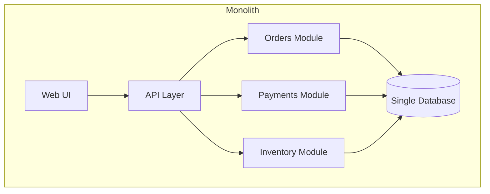
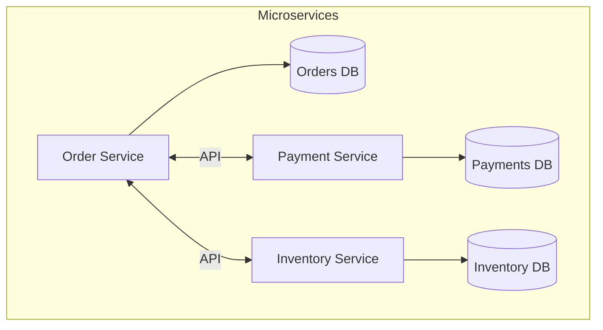

# Microservice Architecture

**In a nutshell:** Build your application as a set of small, independent services that talk to each other over the network, instead of one big deployable monolith.

---

## Why This Pattern Exists

Big, single applications are easy to start with: one codebase, one database, one deployment. But as the product and team grow, that monolith becomes a bottleneck. One bug can bring down everything. Deployments get risky because any change might break unrelated features. Teams step on each other’s toes. Scaling means scaling the whole thing, even when only one part is under load.

Microservice architecture attacks these problems by splitting the system into **services**: small units that you can deploy, scale, and own independently. You give up a bit of simplicity (you now have many services and network boundaries) and gain flexibility, fault isolation, and the ability to scale both the system and the teams.

---

## What It Is

In a **microservice architecture**, the application is a **collection of loosely coupled, independently deployable services**. Each service:

- Is built around a **bounded context** (a clear slice of the business).
- **Owns its own data** (its database or schema).
- Exposes a **well-defined API** (HTTP, gRPC, or messages) and hides internal details.
- Can be developed, tested, and deployed by a team without redeploying the rest of the system.

The opposite is a **monolithic architecture**: one deployable unit, one shared database, one codebase. Everything is deployed together and often scales together.





The first diagram is a monolith: one app, one database. The second is the same domain as microservices: each service has its own data and talks to others via APIs.

---

## Use Cases

- **Scaling development across many teams** – Each team owns one or a few services and can ship without coordinating a single giant release.
- **Different scaling or availability needs** – The checkout path might need more instances than the reporting service; you scale only what you need.
- **Different technology needs** – One service might need a graph database, another a relational one; microservices let you choose per service.
- **Gradual modernization** – You can extract high-value or high-risk parts into services first (e.g. payments, inventory) and leave the rest in the monolith for a while.
- **Organizations that want clear ownership** – “Team X owns the order service” is easier to reason about than “everyone touches the monolith.”
- **Fault isolation** – If the recommendation service goes down, the rest of the system can still take orders (with some degradation) instead of everything failing.

---

## Practical Scenarios

**E-commerce**  
Instead of one app that does orders, payments, inventory, and notifications, you have an Order Service, Payment Service, Inventory Service, and Notification Service. Black Friday hits? Scale the Order and Payment services. Notification can stay at normal size. A bug in recommendations doesn’t take down checkout.

**Multi-tenant SaaS**  
Core platform (auth, billing, product) is one set of services. Tenant-specific or region-specific features (e.g. custom workflows, local compliance) live in other services. You deploy and scale them independently.

**Banking or insurance**  
Regulatory or risk-heavy parts (e.g. KYC, fraud) are isolated in their own services with stricter deployment and security. Other services stay simpler and move faster.

---

## How It Fits Together

Microservices don’t mean “no shared nothing.” They mean:

- **Clear boundaries** – Each service has a focused responsibility.
- **Own data** – No direct DB access from another service; use APIs or events.
- **Independent deployment** – You can release Order Service v2 without touching Payment Service.
- **Failure boundaries** – Use patterns like circuit breakers so one failing service doesn’t bring down the rest.

In this repo, [OrderService](orchestration/Sagas.Orchestration/OrderService), [PaymentService](orchestration/Sagas.Orchestration/PaymentService), and [InventoryService](orchestration/Sagas.Orchestration/InventoryService) are three separate .NET services that together form a small microservice system.

---

## Implementation in .NET

**One service = one runnable app.** Each service has its own:

- `Program.cs` (or `Startup` if you use the older template).
- `appsettings.json` and, if needed, environment-specific config.
- Host (Kestrel) and port.

**Project layout options:**

- **One solution, multiple projects** – Good for small teams and this repo’s style: `Sagas.Orchestration.sln` with OrderService, PaymentService, InventoryService.
- **One repo per service** – Better when teams are fully separate and deploy pipelines are independent.

**Minimal structure per service:**

```csharp
// Program.cs – each service is a small ASP.NET Core app
var builder = WebApplication.CreateBuilder(args);
builder.Services.AddControllers();
var app = builder.Build();
app.MapControllers();
app.Run();
```

Keep each service small and focused. Expose HTTP APIs (or gRPC) for other services; avoid sharing DLLs that contain domain entities across services. Prefer DTOs and contracts (e.g. OpenAPI) at the boundary.

**Deployment:** Each service is typically packaged as its own container (Docker) and deployed to Kubernetes or similar. Health checks (`/health`) and readiness probes are important so the platform knows when a service is up and when to send traffic.

---

## Trade-offs and Pitfalls

**Pros:** Independent deployment and scaling, technology flexibility, fault isolation, clear ownership.

**Cons:** Operational complexity (many services, networking, monitoring), distributed system challenges (latency, partial failure, consistency). Don’t adopt microservices just for the sake of it; use them when team size, scale, or domain complexity justify the cost.

**Common mistakes:** Too many tiny “nanoservices” that only add network hops; sharing databases or domain models across services (creates coupling); ignoring observability (logging, tracing, metrics) and then not being able to debug cross-service flows.

---

## Related Patterns

- [Decompose by business capability](02-decompose-by-business-capability.md) – Defines *how* to slice the system into services (by what the business does).
- [Database per service](05-database-per-service.md) – Each service owns its data; no shared DB.
- [API Gateway](11-api-gateway.md) – Single entry point for clients calling multiple services.

---

## Further Reading

- [microservices.io – Microservice architecture](https://microservices.io/patterns/microservices.html)
- [Microsoft – .NET Microservices: Architecture for Containerized .NET Applications](https://learn.microsoft.com/en-us/dotnet/architecture/microservices/)
