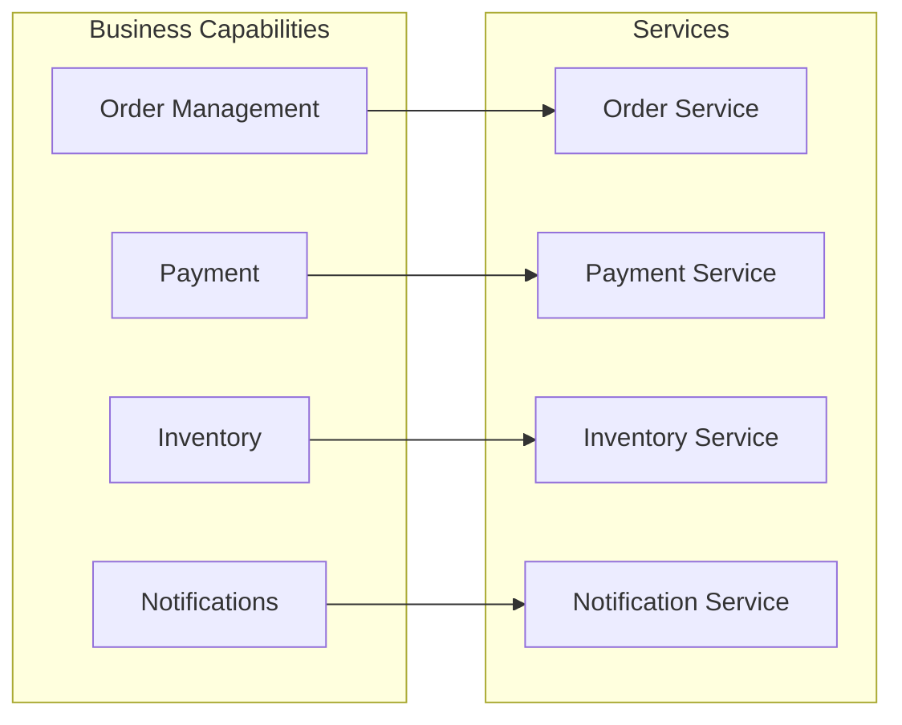

# Decompose by Business Capability

**In a nutshell:** Define your microservices by **what the business does** (e.g. “manage orders,” “process payments,” “track inventory”) instead of by technical layers like “API,” “database,” or “backend.”

---

## Why This Pattern Exists

If you split the system by technical layers, you end up with a “orders team” that touches the same codebase as the “payments team,” and every change risks breaking someone else’s feature. If you split by **business capability**, each service maps to a real business function. The team that owns “payments” owns the whole payment service—API, logic, and data. Changes stay in one place, and the system structure matches how the business thinks and works.

---

## What It Is

**Business capabilities** are the things your organization does to create value: “Take orders,” “Charge customers,” “Manage stock,” “Send notifications,” “Handle returns.” Each capability becomes a candidate for a **service**. The service owns everything needed to deliver that capability: its own API, business logic, and data store. You’re not building “the orders layer” or “the data layer”; you’re building the “Order Management” service and the “Payment” service.



One capability (e.g. “Order Management”) maps to one service. The diagram shows how business capabilities align with the services in this repo.

---

## Use Cases

- **Greenfield microservice systems** – You’re designing from scratch; capabilities give you clear boundaries from day one.
- **Splitting a monolith by function** – “We’ll extract the payment module first” is a capability-based slice.
- **Organizations with domain-oriented teams** – When the business already has “order team,” “payment team,” and “inventory team,” services aligned to capabilities fit that structure.
- **Reducing cross-team conflicts** – Fewer merge conflicts and fewer “who owns this?” discussions when ownership follows capabilities.
- **Easier onboarding** – New developers can understand “this service does orders” without navigating a giant shared codebase.
- **Clearer product roadmap** – Features map to capabilities; you can plan and ship by capability (e.g. “Q1 we improve the Payment service”).

---

## Practical Scenarios

**E-commerce order flow**  
Capabilities: “Order management” (create, update, cancel orders), “Payment” (charge, refund, reconcile), “Inventory” (reserve, release, adjust stock), “Fulfilment” (pick, pack, ship). This repo’s [OrderService](orchestration/Sagas.Orchestration/OrderService), [PaymentService](orchestration/Sagas.Orchestration/PaymentService), and [InventoryService](orchestration/Sagas.Orchestration/InventoryService) follow this idea: each is a capability.

**Subscription billing**  
Capabilities: “Subscription management” (create, change, cancel plans), “Billing” (invoicing, charging), “Usage metering” (collect and aggregate usage), “Dunning” (retry failed payments, notify). Each can be a service.

**Marketplace**  
“Listing management,” “Search and discovery,” “Transaction (order + payment),” “Reviews and ratings,” “Seller payouts.” Each capability is a natural service boundary.

---

## How to Find Capabilities

Ask:

- What does the business do to serve the customer or run the operation? (e.g. “Take order,” “Reserve stock,” “Charge card.”)
- What would you put on an org chart or product roadmap? (e.g. “Orders,” “Payments,” “Inventory.”)
- What can change or scale independently? (e.g. payment providers might change without changing order logic.)

Avoid defining capabilities by technology (“the API service,” “the database service”) or by CRUD (“the order table service”). Think in verbs and nouns the business uses: “Process payment,” “Reserve inventory.”

---

## Implementation in .NET

**One capability = one or more projects (one deployable service).** Each service:

- Has a name that reflects the capability: `OrderService`, `PaymentService`, `InventoryService`.
- Exposes HTTP or message endpoints that represent operations in that capability (e.g. `POST /api/orders`, `POST /api/payments`, `POST /api/inventory`).
- Owns its own data; no other service touches its database.

**Example: identifying capabilities from a user story**

- “As a customer I place an order, pay, and get my items shipped.”
- Capabilities involved: **Order** (create order), **Payment** (charge), **Inventory** (reserve), **Fulfilment** (ship). So you have at least four capability-based services.

**Project layout:**

```
Sagas.Orchestration.sln
  OrderService/       <- Order management capability
  PaymentService/     <- Payment capability
  InventoryService/   <- Inventory capability
```

Each project has its own controllers, models, and (when you add persistence) its own DbContext and migrations. Don’t share domain entities across projects; use DTOs or events at the boundary. When one capability needs to trigger another (e.g. order triggers payment), do it via API calls or messages, not by sharing code or database.

---

## Trade-offs and Pitfalls

**Pros:** Clear ownership, changes localized to one capability, structure that matches the business, easier to reason about consistency within a capability.

**Cons:** Some workflows span capabilities (e.g. “place order” touches order, payment, inventory). You need patterns like [Saga](06-saga-pattern.md) or [domain events](10-domain-events.md) to coordinate; capability boundaries don’t remove that need, they just make them explicit.

**Common mistakes:** Defining too many tiny capabilities (e.g. “Create order” vs “Update order” as separate services—usually one “Order” capability is enough). Or defining by data (“the customer service”) instead of by what the business does (“customer onboarding,” “customer support”—might be one or two capabilities).

---

## Related Patterns

- [Decompose by subdomain (DDD)](03-decompose-by-subdomain.md) – Refines boundaries using subdomains and bounded contexts; often used together with capability-based decomposition.
- [Microservice architecture](01-microservice-architecture.md) – The overall style; this pattern tells you how to slice it.
- [Saga](06-saga-pattern.md) – Coordinates multi-step flows that span several capabilities (e.g. order → payment → inventory).

---

## Further Reading

- [microservices.io – Decompose by business capability](https://microservices.io/patterns/decomposition/decompose-by-business-capability.html)
