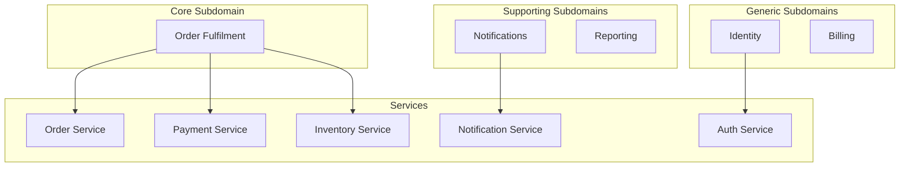

# Decompose by Subdomain (DDD)

**In a nutshell:** Use **Domain-Driven Design (DDD)** to find service boundaries: split by **subdomains** (core, supporting, generic) and **bounded contexts**, so each service has a clear domain and its own language and model.

---

## Why This Pattern Exists

Not all parts of the business are equally important. The “core” of an e-commerce system might be order fulfilment and payment; “supporting” might be notifications and basic reporting; “generic” might be auth or billing that could be bought or shared. If you treat everything the same, you risk blurring boundaries and creating one big shared model that’s hard to change. DDD gives you a way to separate **core** from **supporting** and **generic** and to draw **bounded contexts**—each with its own vocabulary and rules. Those bounded contexts map naturally to microservices: one context, one service (or a small set of services), and no shared “god” model across the system.

---

## What It Is

In DDD:

- **Subdomain** – A part of the business. **Core** subdomains are what make you competitive; **supporting** subdomains are needed but not your differentiator; **generic** subdomains are common problems (auth, billing) that you might buy or reuse.
- **Bounded context** – A boundary within which a single **ubiquitous language** and a single **model** apply. One bounded context does not use the internal model of another; they integrate via APIs, events, or anti-corruption layers.
- **Decompose by subdomain** – You identify subdomains and bounded contexts first, then align **services to bounded contexts**. So you get “Order Fulfilment” (core), “Notifications” (supporting), “Identity” (generic), etc., each as its own service with its own model.



Core gets the most investment and clear boundaries; supporting and generic can be simpler or off-the-shelf.

---

## Use Cases

- **Complex domains** – When the business has a lot of rules and language (e.g. insurance, banking, logistics), DDD helps keep that complexity inside clear boundaries.
- **Avoiding a single shared model** – When “order” means different things to sales, fulfilment, and finance, bounded contexts let each have its own definition and integrate explicitly.
- **Prioritizing investment** – Core subdomains get the best design and team; supporting and generic can be simpler or outsourced.
- **Large or multi-team systems** – Bounded contexts reduce coupling and clarify “this team owns this model.”
- **Greenfield or major redesign** – When you have a chance to model the domain properly instead of mirroring a legacy database.

---

## Practical Scenarios

**E-commerce**  
- **Core:** Order fulfilment (order lifecycle, payment, inventory reservation). Services: Order, Payment, Inventory, as in this repo.  
- **Supporting:** Notifications (emails, SMS), reporting (dashboards, analytics).  
- **Generic:** Identity (login, roles), billing (invoicing, tax). Identity might be Auth0 or a small auth service; billing might be Stripe or an internal billing service.

**Insurance**  
- **Core:** Underwriting, claims handling.  
- **Supporting:** Document management, customer portal.  
- **Generic:** Identity, payments, document storage (e.g. blob store).

**Healthcare**  
- **Core:** Clinical pathways, care plans.  
- **Supporting:** Scheduling, reporting.  
- **Generic:** Patient identity, HL7/FHIR integration.

---

## How It Works

1. **Identify subdomains** – What’s core to the business? What’s supporting? What’s generic?
2. **Define bounded contexts** – Within each (sub)domain, where does the language or model change? Those are context boundaries. One bounded context = one consistent model and language.
3. **Map services to contexts** – Each bounded context is implemented by one or more services. They don’t share domain entities; they share only contracts (DTOs, events, API specs).
4. **Integrate at boundaries** – Use APIs, events, or anti-corruption layers so that “Order” in the Order context and “Order” in the Fulfilment context can differ; you translate at the boundary.

---

## Implementation in .NET

**Inside each service (bounded context):** Use DDD building blocks:

- **Entities** – Objects with identity (e.g. `Order`, `Payment`).
- **Value objects** – Immutable values (e.g. `Money`, `Address`).
- **Aggregates** – Clusters of entities with a root; changes go through the root.
- **Domain events** – “Something happened” (e.g. `OrderPlaced`) for internal or cross-service use.
- **Repositories** – Persist and load aggregates; hide storage details.

**Between services:** Don’t share domain model DLLs. Use:

- **DTOs** – For HTTP APIs (e.g. `CreateOrderRequest`, `OrderSummaryResponse`).
- **Events** – For async messaging (e.g. `OrderCreated` with only the data others need).

**Project structure per bounded context:**

```
OrderService/
  Domain/
    Aggregates/
    Entities/
    ValueObjects/
    Events/
  Application/
    Commands/
    Queries/
  Api/
    Controllers/
    DTOs/
```

Keep the domain layer free of HTTP and infrastructure; application layer orchestrates and calls the domain; API layer exposes DTOs. In this repo, each of Order, Payment, and Inventory can be treated as a bounded context with its own `Models` (and later a proper Domain folder). Avoid one shared “Common.Models” that every service references—that breaks bounded contexts.

---

## Trade-offs and Pitfalls

**Pros:** Boundaries that match the domain, clear language per context, better prioritization (core vs supporting), less “god model” coupling.

**Cons:** DDD has a learning curve; it’s easy to over-model in simple contexts. Integration between contexts (mapping, events) adds work. Not every system needs full DDD—use it where the domain is complex or the team is large.

**Common mistakes:** One shared domain model across all services (no real bounded contexts). Treating every subdomain as “core” (no prioritization). Skipping the ubiquitous language and ending up with technical names that don’t match the business.

---

## Related Patterns

- [Decompose by business capability](02-decompose-by-business-capability.md) – Capabilities often align with subdomains; capability = “what we do,” subdomain = “where it fits (core/supporting/generic).”
- [Database per service](05-database-per-service.md) – Each bounded context (service) has its own database.
- [Domain events](10-domain-events.md) – How bounded contexts communicate “something happened” without sharing models.

---

## Further Reading

- [microservices.io – Decompose by subdomain](https://microservices.io/patterns/decomposition/decompose-by-subdomain.html)
- Eric Evans, *Domain-Driven Design* (book); Vaughn Vernon, *Implementing Domain-Driven Design* (book)
