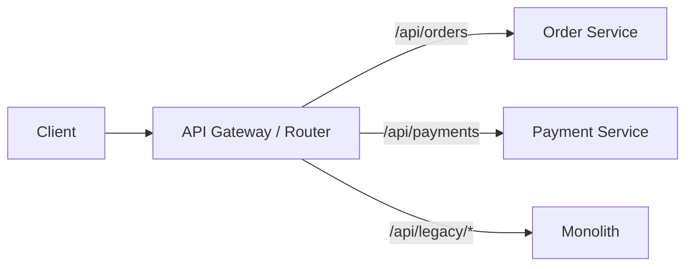
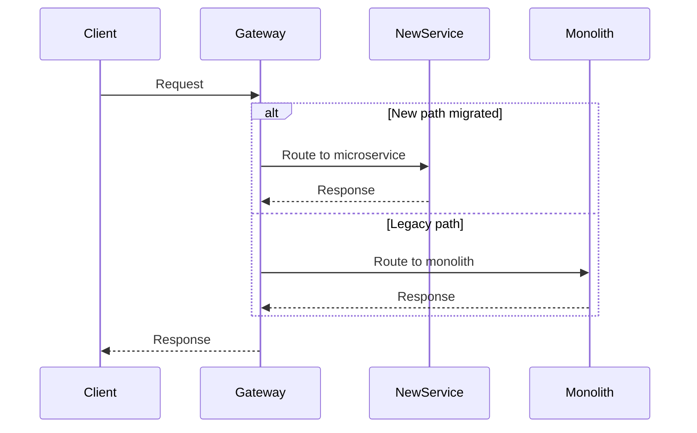

# Strangler Application

**In a nutshell:** Migrate from a monolith to microservices **gradually** by “strangling” the old system: new features and replaced features go into new services, while the monolith keeps running until piece by piece it’s no longer needed.

---

## Why This Pattern Exists

Rewriting a large monolith in one go is risky and slow. Business can’t wait years for a big-bang release, and the new system might repeat old mistakes. The **Strangler Fig** idea (from Martin Fowler) is the opposite: you grow the new system around the old one. New functionality goes into new services. Existing functionality is replaced step by step—first you route traffic to a new service that does the same thing, then you retire that part of the monolith. Over time the monolith shrinks and eventually disappears. You deliver value continuously and learn as you go.

---

## What It Is

A **strangler application** is the new system (microservices + routing) that gradually takes over the monolith’s responsibilities. You don’t replace the monolith in one shot. Instead you:

1. **Introduce a facade** – API Gateway or reverse proxy in front of both the monolith and the new services.
2. **Route by path or feature** – Certain URLs or operations go to new services; the rest still hit the monolith.
3. **Migrate one slice at a time** – Pick a capability (e.g. “create order”), build or move it to a microservice, switch the route to the new service, then disable that code in the monolith.
4. **Repeat** – Until the monolith is empty (or small enough to retire).

The “strangler” is the new architecture wrapping and eventually replacing the old one, like a strangler fig tree that grows around a host tree.



At first most routes go to the monolith. As you migrate, more routes go to new services and the monolith handles less.

---

## Use Cases

- **Migrating a large monolith** – When a full rewrite is too risky or too slow, strangling lets you move in small steps.
- **Delivering value while migrating** – Teams can ship new features in microservices and still maintain the monolith.
- **Learning the new architecture** – You can tune microservices, observability, and deployment with a few services before committing to the full split.
- **Regulatory or risk-sensitive environments** – Gradual cutover with feature flags or routing rules allows controlled rollout and quick rollback.
- **When the monolith can’t be replaced in one release** – Maybe it’s too big, or there’s no “maintenance window” to switch everything at once.

---

## Practical Scenarios

**Replace “create order” first**  
The monolith today has `POST /orders`. You build a new Order Service with the same contract. You put a gateway in front; initially `/orders` still goes to the monolith. You add a route so `/v2/orders` (or a feature-flagged path) goes to the new Order Service. Once you’re confident, you point `/orders` to the new service and remove the order-creation code from the monolith. Payment and inventory might still be in the monolith; the new Order Service calls the monolith’s payment and inventory APIs for now (anti-corruption layer). Later you extract those too.

**E-commerce checkout**  
Checkout is a critical path. You don’t rewrite it in one go. You might: (1) Move “get cart” to a Cart Service, (2) Move “apply coupon” to a Promotions Service, (3) Move “place order” to an Order Service that calls the monolith for payment and inventory, (4) Then move payment and inventory out. Each step is a small release with a rollback plan.

**Legacy reporting**  
The monolith has a heavy report that slows the DB. You add a new Reporting Service that reads from a replica or a data warehouse and exposes the same report. You route “report X” to the new service; the monolith’s report code is eventually removed.

---

## How It Works

**Step 1: Put a router in front**  
All client traffic goes to an API Gateway or reverse proxy (e.g. YARP, Ocelot, Nginx). The gateway has routing rules: by path, header, or feature flag.

**Step 2: Implement one capability in a new service**  
Build the new service with the same (or better) API as the monolith’s module. Use an **anti-corruption layer** if the new service must call the monolith: translate between your clean model and the monolith’s quirks in one place.

**Step 3: Route traffic to the new service**  
Change the gateway so the relevant requests go to the new service. Use feature flags or canary routing so you can turn it off if something goes wrong.

**Step 4: Retire the monolith’s code**  
Once the new service is stable and the old path is unused, remove the migrated code from the monolith. The monolith shrinks.

**Step 5: Repeat**  
Pick the next capability and repeat. Over time the monolith is “strangled” and the new system takes over.



---

## Implementation in .NET

**Router / API Gateway**  
Use **YARP** (Yet Another Reverse Proxy) or **Ocelot** so all traffic hits one place. Configure routes in config or code.

**YARP example (conceptual):**

```csharp
// In the gateway project, route config
// Routes: /api/orders/* -> Order Service, /api/* -> Monolith
builder.Services.AddReverseProxy()
    .LoadFromConfig(builder.Configuration.GetSection("ReverseProxy"));
```

Config:

```json
{
  "ReverseProxy": {
    "Routes": {
      "order-route": {
        "ClusterId": "order-service",
        "Match": { "Path": "/api/orders/{**catch-all}" }
      },
      "legacy-route": {
        "ClusterId": "monolith",
        "Match": { "Path": "/api/{**catch-all}" }
      }
    },
    "Clusters": {
      "order-service": {
        "Destinations": { "default": { "Address": "https://localhost:5001" } }
      },
      "monolith": {
        "Destinations": { "default": { "Address": "https://localhost:5000" } }
      }
    }
  }
}
```

New services (e.g. Order Service) are normal ASP.NET Core apps. They can call the monolith via `HttpClient` for capabilities not yet extracted; wrap those calls in an anti-corruption layer so the monolith’s API doesn’t leak into your domain model. Use feature flags (e.g. LaunchDarkly, or a simple config switch) to toggle routing to the new service without redeploying the gateway.

---

## Trade-offs and Pitfalls

**Pros:** Lower risk than big-bang rewrite, continuous delivery, chance to learn and adjust the new architecture, business keeps running.

**Cons:** You run two systems for a while (operational cost); the monolith may still need changes during the migration; routing and feature flags add complexity.

**Common mistakes:** Migrating by technical layer (e.g. “move all APIs first”) instead of by capability—prefer “move order creation” end to end. Not having an anti-corruption layer when the new service calls the monolith, so monolith quirks spread. No rollback plan (feature flag or route revert) when the new service misbehaves.

---

## Related Patterns

- [API Gateway](11-api-gateway.md) – The gateway is what you use to route between monolith and new services.
- [Decompose by business capability](02-decompose-by-business-capability.md) – Tells you *what* to extract next (one capability at a time).
- [Anti-corruption layer](https://microservices.io/patterns/refactoring/anti-corruption-layer.html) – Isolates the new service from the monolith’s model when they must talk.

---

## Further Reading

- [microservices.io – Strangler Application](https://microservices.io/patterns/refactoring/strangler-application.html)
- Martin Fowler, [StranglerFigApplication](https://martinfowler.com/bliki/StranglerFigApplication.html)
