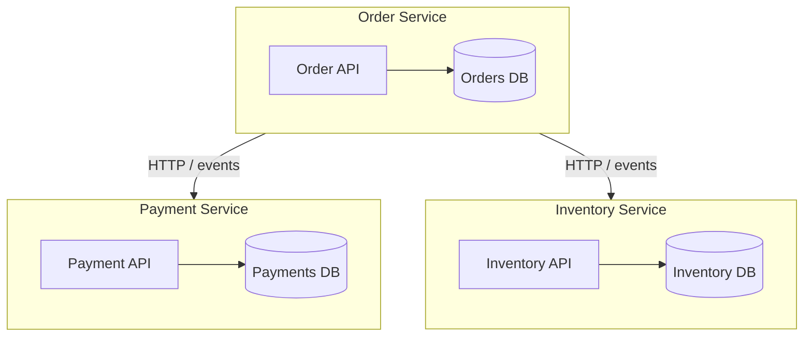

# Database per Service

**In a nutshell:** Every microservice has **its own private database** (or schema). No other service connects to it directly. All access to that data goes through the service’s API or events. That keeps services loosely coupled and lets each one choose the right storage technology.

---

## Why This Pattern Exists

In a monolith, one database serves the whole app. When you split into services, the easiest mistake is to keep one shared database. Then every service depends on the same schema. A change in “the orders table” can break the payment and inventory services. You can’t scale one service’s data independently, and you can’t easily use different storage (e.g. document store for one, relational for another). **Database per service** fixes this: each service **owns** its data. If you need data from another service, you ask that service (API or events), you don’t query its database. Coupling stays at the API boundary instead of deep in the data layer.

---

## What It Is

**Database per service** means:

- Each microservice has **one logical database** (or schema) that only that service uses.
- No other service has connection strings, queries, or direct access to that database.
- Other services get data by **calling the service’s API** or by **reacting to events** the service publishes.
- Each service can pick the right storage: SQL, NoSQL, cache, etc.

So you might have: Order Service → Orders DB, Payment Service → Payments DB, Inventory Service → Inventory DB. Order Service never runs `SELECT * FROM Payments`; it calls Payment Service’s API or listens to payment events.



No arrow from Order Service to Payment DB or Inventory DB—only to the other services’ APIs.

---

## Use Cases

- **Any microservice system that wants real autonomy** – Services can change their schema, add indexes, or even change the database engine without coordinating with others.
- **Different storage needs** – Orders might need ACID and relations (SQL); product catalog might need flexible schema (document DB); session data might need speed (Redis). Each service picks what fits.
- **Independent scaling** – Scale the orders database (replicas, sharding) without touching payment or inventory storage.
- **Clear ownership** – “The payment team owns the payments database” is unambiguous; no shared tables to argue over.
- **Compliance and boundaries** – Sensitive data (e.g. payments) stays in one service and one DB; access is only through a controlled API and audit trail.

---

## Practical Scenarios

**E-commerce (this repo)**  
Order Service stores orders and order state in its own DB. Payment Service stores charges, refunds, and payment methods. Inventory Service stores stock levels and reservations. When Order Service needs to “process payment,” it calls Payment Service’s API; when it needs to “reserve inventory,” it calls Inventory Service’s API. Data is never read from another service’s DB. When you add persistence to this repo’s [OrderService](orchestration/Sagas.Orchestration/OrderService), that persistence should be an Orders DB only—no Payment or Inventory tables there.

**Multi-tenant SaaS**  
Tenant metadata might live in an Identity or Tenant service and its DB. The main product service doesn’t have a `Tenants` table; it calls the Tenant API or gets tenant id from a token and trusts the other service. Billing data stays in a Billing service and its DB; other services don’t query billing tables.

**Reporting and analytics**  
Reporting often needs data from many domains. Instead of giving the reporting app access to every service’s DB (which would break “database per service”), you use **API composition** or **CQRS**: a composer or a read model that gets data via APIs or subscribes to events and builds a dedicated reporting store. That store is owned by the reporting service; the source services keep owning their own DBs.

---

## How It Works

- **Write path:** A request comes to the service; the service runs its logic and writes only to **its own** database in a normal transaction. If it needs another service to do something (e.g. charge payment), it calls that service’s API or sends a message; it does not write to the other service’s DB.
- **Read path:** To get data it doesn’t own, the service calls another service’s API or uses data it got from events (e.g. a local copy or cache). It never runs a query against another service’s database.
- **Consistency:** You give up single-DB ACID across services. Consistency across services is **eventual** and is achieved with patterns like [Saga](06-saga-pattern.md), [domain events](10-domain-events.md), and [transactional outbox](15-transactional-outbox.md).

---

## Implementation in .NET

**One DbContext (or one connection scope) per service.** Each service project has:

- Its own connection string in `appsettings.json` (e.g. `OrderDb`, `PaymentDb`, `InventoryDb`).
- Its own EF Core `DbContext` that only knows about **that service’s** entities and tables.
- Its own migrations; run them only in that service’s project.

**Example: Order Service with its own DB**

```csharp
// OrderService/Data/OrderDbContext.cs
public class OrderDbContext : DbContext
{
    public OrderDbContext(DbContextOptions<OrderDbContext> options) : base(options) { }
    public DbSet<Order> Orders => Set<Order>();
    // Only Order-related entities. No Payment, no Inventory.
}

// Program.cs
builder.Services.AddDbContext<OrderDbContext>(options =>
    options.UseSqlServer(builder.Configuration.GetConnectionString("OrderDb")));
```

**Example: Payment Service with its own DB**

```csharp
// PaymentService/Data/PaymentDbContext.cs
public class PaymentDbContext : DbContext
{
    public DbSet<Payment> Payments => Set<Payment>();
    public DbSet<Refund> Refunds => Set<Refund>();
    // Only payment-related entities.
}
```

**What not to do:** Don’t create a “shared” DbContext or a project that multiple services reference to read “each other’s” tables. Don’t run a query in Order Service that hits the Payment database. If Order Service needs payment status, it calls Payment Service’s API (e.g. `GET /api/payments?orderId=...`) or keeps a small local view updated from payment events.

**In this repo:** When you add real persistence, [OrderRepository](orchestration/Sagas.Orchestration/OrderService/Services/OrderRepository.cs) should use an `OrderDbContext` and an Orders database only. Payment and Inventory services would have their own DbContexts and databases. No cross-service DB access.

---

## Trade-offs and Pitfalls

**Pros:** Loose coupling, technology flexibility per service, independent scaling and schema evolution, clear ownership.

**Cons:** No cross-service joins; you need APIs or events to get data from other services. Cross-service consistency is eventual and requires patterns (Saga, events). More moving parts (multiple DBs to backup, monitor, migrate).

**Common mistakes:** Sharing a database “just for reads” or “just for reporting”—that still couples schema and deployment. Giving one service a connection string to another service’s DB “temporarily”—it becomes permanent and breaks the pattern. Forgetting that “database per service” can mean one schema per service in a shared DB instance in early stages, but the logical rule is the same: no direct access from another service.

---

## Related Patterns

- [Saga](06-saga-pattern.md) – Coordinates multi-step workflows across services when each step touches only its own DB.
- [API composition](09-api-composition.md) – How to “join” data from multiple services without shared DB (call APIs, combine in memory).
- [Event sourcing](08-event-sourcing.md) / [Domain events](10-domain-events.md) – Services publish what happened; others build their own views or react without touching your DB.

---

## Further Reading

- [microservices.io – Database per service](https://microservices.io/patterns/data/database-per-service.html)
