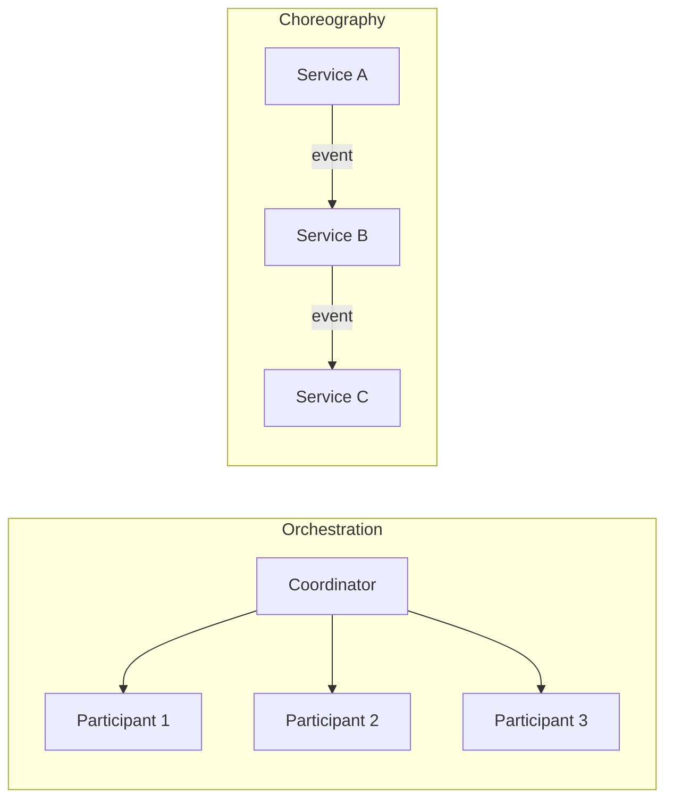
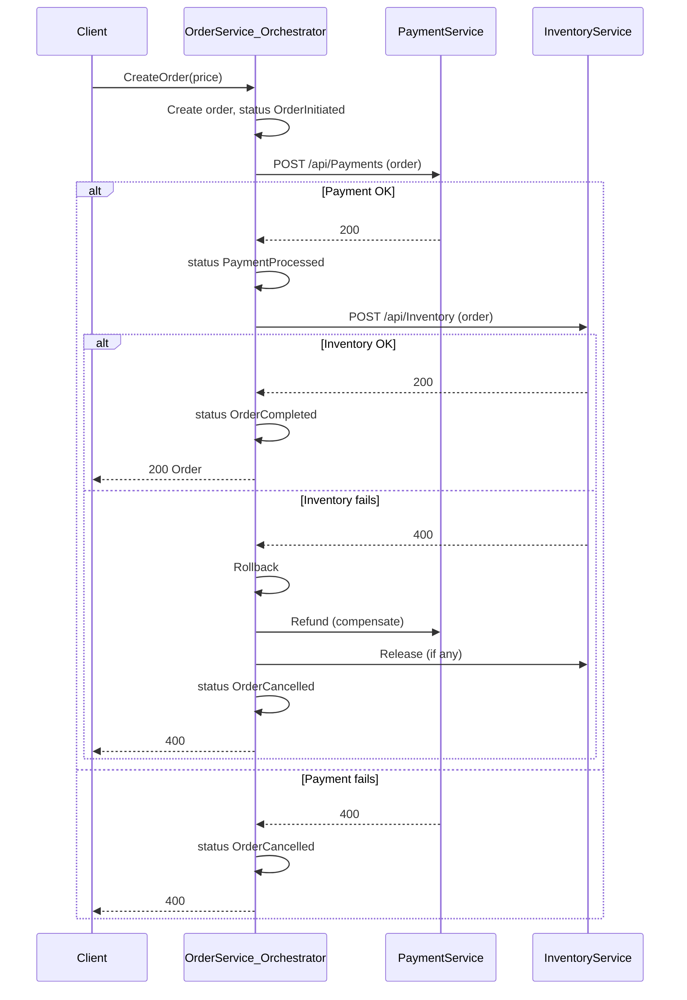

# Saga Pattern

**In a nutshell:** When a business flow spans several microservices (and several databases), you can’t use one big transaction. A **Saga** keeps things consistent by running a **sequence of local transactions**—one per service—and **undoing** earlier steps with **compensating actions** if something fails later.

---

## Why This Pattern Exists

In a monolith, “place order” might be one database transaction: insert order, reserve stock, charge payment, all commit or all roll back. With microservices, each of those steps lives in a different service with its own database. There’s no distributed transaction (2PC) that everyone wants to use in a high-scale system—they’re complex and block. So you need another way to get **eventual consistency**: do each step in its own service as a **local transaction**, and if a later step fails, **compensate** by undoing the previous steps in reverse order. That sequence of local transactions plus compensations is a **Saga**.

---

## What It Is

A **Saga** is a way to implement a multi-step business process across services without a single distributed transaction. It has two main ideas:

1. **Local transactions** – Each step runs in one service and commits in that service’s database. So you get “create order” (Order Service), “process payment” (Payment Service), “reserve inventory” (Inventory Service), each with its own transaction.
2. **Compensating transactions** – If step 3 fails, you don’t roll back step 1 and 2 in the DB sense (they’re already committed). Instead you run **compensating actions**: logical “undo” operations. For example: release inventory, refund payment, mark order cancelled.

You can run a Saga in two styles:

- **Orchestration** – A central **coordinator** (one service) tells each participant what to do and in what order, and triggers compensations if something fails. Easy to understand and debug; the coordinator can get complex.
- **Choreography** – There’s no central coordinator. Each service reacts to **events** (e.g. OrderCreated, PaymentCompleted). When it finishes its step, it publishes the next event. If something goes wrong, it publishes a compensation event and others react. Decentralized but harder to see the full flow and to add compensations.



---

## Use Cases

- **Order fulfilment** – Create order → reserve inventory → charge payment → ship. Each step in a different service; if payment fails, release inventory and cancel order.
- **Travel booking** – Book flight, hotel, car. If the car booking fails, cancel hotel and flight.
- **Subscription sign-up** – Create account → create subscription → charge first payment → send welcome email. If charge fails, remove subscription and maybe account.
- **Any multi-step flow that spans services** – Whenever you need “all or nothing” behaviour across several services but can’t use a single transaction, a Saga gives you a way to get there with compensations.
- **Refunds and returns** – Reverse flow: cancel order, release inventory, refund payment—again as a sequence of steps and compensations.

---

## Practical Scenarios

**E-commerce checkout (this repo)**  
The repo implements an **orchestrated** Saga. [OrdersController.CreateOrder](orchestration/Sagas.Orchestration/OrderService/Controllers/OrdersController.cs) is the coordinator:

1. Create order in Order Service (local transaction) → status `OrderInitiated`.
2. Call Payment Service to process payment → on success, status `PaymentProcessed`.
3. Call Inventory Service to reserve inventory → on success, status `InventoryReserved`, then `OrderCompleted`.
4. If any step throws, the catch block calls `Rollback(order)` and sets status `OrderCancelled`.

Right now `Rollback` is a stub (`await Task.CompletedTask`). In production you’d call Payment Service to refund and Inventory Service to release the reservation. The flow and states are in [OrderStatus](orchestration/Sagas.Orchestration/OrderService/Enumerations/OrderStatus.cs): `OrderInitiated`, `PaymentProcessed`, `InventoryReserved`, `OrderCompleted`, `OrderCancelled`.

**Subscription billing**  
Steps: Create subscription record → provision access → charge card → send confirmation. If charging fails, de-provision access and mark subscription as failed (compensations).

**Shipping and returns**  
Ship order: create shipment → update inventory (deduct) → notify warehouse. Return: receive item → restore inventory → refund payment. Each is a Saga with compensations if a step fails.

---

## How It Works: Orchestration (with this repo)

The coordinator (Order Service) holds the saga state (e.g. order id and current status), calls participants in order, and decides when to compensate.



Notice: compensations run in **reverse order** of the steps that succeeded (e.g. if inventory fails, you compensate payment first, then you don’t need to compensate “create order” if you mark it cancelled).

---

## How It Works: Choreography

There’s no single coordinator. Each service subscribes to events and does its bit, then publishes the next event.

- Order Service: creates order → publishes **OrderCreated**.
- Payment Service: handles OrderCreated → charges → publishes **PaymentCompleted** or **PaymentFailed**.
- Inventory Service: handles PaymentCompleted → reserves stock → publishes **InventoryReserved** or **InventoryReservationFailed**.

If PaymentFailed or InventoryReservationFailed, someone (e.g. Order Service or a dedicated handler) subscribes and runs compensations (refund, release, cancel order). Choreography avoids a central bottleneck but makes the flow harder to see and change; orchestration keeps the flow in one place.

---

## Implementation in .NET

**Orchestration (like this repo)**  
The coordinator is an API or a long-running process that:

1. Persists saga state (e.g. order id, current step, status) so you can resume after a crash.
2. Calls participants (e.g. `HttpClient` to Payment and Inventory).
3. On success, updates state and calls the next step.
4. On failure, runs compensations in reverse order (call refund API, release API, update order to cancelled).
5. Uses **idempotency** so retries don’t double-charge or double-reserve.

**Improving the repo’s Rollback:**  
Replace the stub with real compensation calls:

```csharp
private async Task Rollback(Order order, CancellationToken token)
{
    // Compensate in reverse order of what succeeded.
    // If we reached InventoryReserved, we did: order -> payment -> inventory.
    if (order.Status == OrderStatus.InventoryReserved)
    {
        await ReleaseInventory(order, token);  // POST /api/Inventory/release
        await RefundPayment(order, token);    // POST /api/Payments/refund
    }
    else if (order.Status == OrderStatus.PaymentProcessed)
    {
        await RefundPayment(order, token);
    }
    // If OrderInitiated only, nothing to compensate except mark order cancelled.
    await _orderRepository.UpdateStatus(order.Id, OrderStatus.OrderCancelled);
}
```

Use **Polly** for retries and **circuit breakers** when calling Payment and Inventory so a failing service doesn’t hang the coordinator. Prefer **IHttpClientFactory** and typed clients instead of `new HttpClient()`.

**Choreography**  
Use a message broker (RabbitMQ, Azure Service Bus) and a library like **MassTransit** or **NServiceBus**. Each service has consumers for the events it cares about. Publish domain events from the service that performed the action; other services subscribe and run their local transaction, then publish the next event. Use **idempotent consumers** so duplicate delivery doesn’t double-apply.

**Saga libraries**  
- **MassTransit** – State machine sagas with persistence (e.g. Redis, SQL). Good for choreography and for orchestration-style flows expressed as state machines.  
- **Durable Task Framework** – Orchestration with durable steps and compensations. Good when the coordinator is a separate process.

---

## Trade-offs and Pitfalls

**Pros:** You get cross-service consistency without distributed 2PC; each service keeps its own transaction boundary; the pattern is well understood.

**Cons:** Compensations are not always perfect (e.g. refund might take days; you have to handle “compensation failed” and manual intervention). Saga state and retries add complexity. Orchestration can make the coordinator a bottleneck; choreography can be hard to trace and change.

**Common mistakes:** Forgetting to implement compensations (like the repo’s empty `Rollback`). Compensating in the wrong order. Not making steps and compensations idempotent (retries cause double charge or double release). Not persisting saga state (coordinator crash loses where you were).

---

## Related Patterns

- [Database per service](05-database-per-service.md) – Each Saga step touches only one service’s DB; that’s why you need a Saga instead of one transaction.
- [Domain events](10-domain-events.md) – Choreography sagas are event-driven; events are the “next step” or “compensate” signals.
- [Transactional outbox](15-transactional-outbox.md) – When a step publishes an event in the same transaction as its DB write, use the outbox so the event isn’t lost.
- [Idempotent consumer](13-idempotent-consumer.md) – Saga participants and compensations must be idempotent for safe retries.

---

## Further Reading

- [microservices.io – Saga](https://microservices.io/patterns/data/saga.html)
- This repo: [OrderService](orchestration/Sagas.Orchestration/OrderService), [PaymentService](orchestration/Sagas.Orchestration/PaymentService), [InventoryService](orchestration/Sagas.Orchestration/InventoryService)
