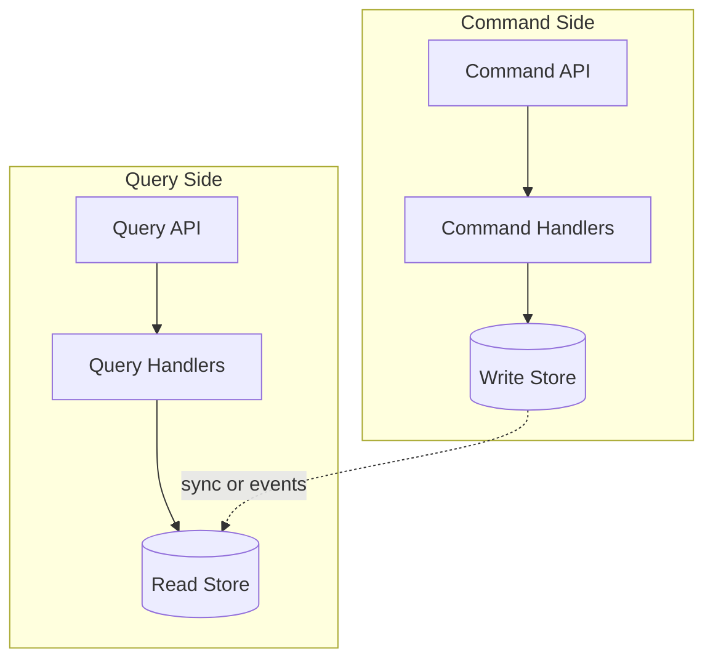

# CQRS (Command Query Responsibility Segregation)

**In a nutshell:** Split your model into two: one for **writing** (commands that change state) and one for **reading** (queries that return data). That way you can scale, optimize, and shape read and write independently—and you can use different storage or even different services for each.

---

## Why This Pattern Exists

In a classic app, the same model and the same database serve both “create an order” and “show me my order history.” That works until reads and writes have different needs: lots of complex queries, reporting, or search on one side, and simple but high-throughput writes on the other. Or the read shape (e.g. a dashboard with joined data) is nothing like the write shape (normalized entities). **CQRS** says: treat **commands** (writes) and **queries** (reads) as different responsibilities. Have a **command side** that validates and persists changes, and a **query side** that serves read-optimized data—different models, and often different stores. You get flexibility to scale and tune each side and to keep the write model simple while the read model can be denormalized and tailored for screens and reports.

---

## What It Is

**CQRS** stands for **Command Query Responsibility Segregation**. The idea comes from CQS (Command Query Separation): either a method changes state (command) or it returns data (query), not both. CQRS takes that further:

- **Command side** – Handles operations that **change state**: CreateOrder, CancelOrder, UpdateAddress. It validates, applies domain rules, and writes to the **write store** (often the source of truth: DB or event store). It usually returns only success/failure or an id, not full entities.
- **Query side** – Handles **reads**: GetOrder, GetMyOrders, GetOrderHistory. It reads from a **read store** (can be the same DB, a replica, or a separate denormalized store or materialized view). The read model is shaped for the UI or API, not for the domain’s internal structure.

You don’t have to use two databases; you can have one database with a clear separation in code (command handlers vs query handlers, different DTOs). When you need more, you add a separate read store (e.g. a copy updated from events) and keep the write store as the single source of truth for commands.



Often the read store is updated from **events** published when the command side changes state (that’s where CQRS and event sourcing work well together).

---

## Use Cases

- **Different read vs write load** – Many more reads than writes (e.g. product catalog, dashboards), or the opposite; you want to scale and tune each side separately.
- **Different read vs write shape** – Writes are simple (e.g. “order created”); reads need joins, aggregates, or search (e.g. “my orders with status and last payment”). The read model can be denormalized without complicating the write model.
- **Reporting and analytics** – Heavy reporting must not slow down or lock the transactional write path; reporting reads from a separate store or replica.
- **Event sourcing** – When the write side stores events, the read side is naturally a **projection** (read model) built from those events; CQRS is the standard way to expose that data.
- **Multiple read models** – Different UIs need different shapes (e.g. “my orders” list vs “order detail” vs “admin dashboard”). You maintain one or more read models tailored to each.

---

## Practical Scenarios

**Order service**  
- **Commands:** CreateOrder, CancelOrder, UpdateShippingAddress. Handlers validate, update aggregates or append events, and write to the write store. Return order id or success.  
- **Queries:** GetOrder(id), GetOrdersByCustomer(customerId), GetOrderHistory. Handlers read from a read store (table or view) shaped for “order list” and “order detail.” The read store can be updated by the same process (e.g. after command) or by a subscriber to domain events.

**E-commerce product catalog**  
- **Commands:** CreateProduct, UpdatePrice, Discontinue. Simple write path.  
- **Queries:** Search products, filter by category, “products you might like.” Read side might be Elasticsearch or a denormalized table optimized for search and listing.

**Dashboard and reporting**  
- **Commands:** Same as your core domain (orders, payments, etc.).  
- **Queries:** Dashboard “orders last 7 days,” “revenue by region.” Read from a reporting DB or data warehouse that’s fed by events or ETL from the write store; the write path never runs these heavy queries.

---

## How It Works

1. **Client sends a command** – e.g. CreateOrder(OrderId, CustomerId, Items). The command is a small DTO; it doesn’t contain full entities from the read model.
2. **Command handler** – Validates, loads aggregate (if needed), applies the change, persists to the write store. Optionally publishes a domain event (OrderCreated).
3. **Read model update** – If you have a separate read store, it’s updated by: (a) the same process right after the write, or (b) an event handler that listens to OrderCreated and updates the read table/view. The read model might be “orders list” or “order detail” or both.
4. **Client sends a query** – e.g. GetOrder(id). Query handler reads from the read store and returns a DTO. No business logic that changes state; just read and map.

Consistency: the read side is often **eventually consistent** with the write side (e.g. a few hundred ms delay). If you use the same DB for both and update in one transaction, you can have strong consistency for simple cases.

---

## Implementation in .NET

**Simple CQRS in one service (same DB)**  
Use two “sides” in code: command handlers and query handlers. Commands change state; queries only read.

**Command side example:**

```csharp
// Command
public record CreateOrderCommand(Guid CustomerId, decimal Amount, List<OrderItemDto> Items);

// Command handler
public class CreateOrderHandler : IRequestHandler<CreateOrderCommand, Guid>
{
    private readonly OrderDbContext _db;
    public CreateOrderHandler(OrderDbContext db) => _db = db;

    public async Task<Guid> Handle(CreateOrderCommand cmd, CancellationToken ct)
    {
        var order = new Order(cmd.CustomerId, cmd.Amount, cmd.Items);
        _db.Orders.Add(order);
        await _db.SaveChangesAsync(ct);
        return order.Id;
    }
}
```

**Query side example:**

```csharp
// Query
public record GetOrderQuery(Guid OrderId);

// Query model (read DTO)
public class OrderDetailDto
{
    public Guid Id { get; set; }
    public string Status { get; set; }
    public decimal Total { get; set; }
    // ... shaped for the UI
}

// Query handler
public class GetOrderHandler : IRequestHandler<GetOrderQuery, OrderDetailDto>
{
    private readonly OrderDbContext _db;  // or read-only replica
    public async Task<OrderDetailDto> Handle(GetOrderQuery query, CancellationToken ct)
    {
        return await _db.Orders
            .Where(o => o.Id == query.OrderId)
            .Select(o => new OrderDetailDto { Id = o.Id, Status = o.Status, ... })
            .FirstOrDefaultAsync(ct);
    }
}
```

**MediatR** fits well: register handlers, and from the API you send commands and queries:

```csharp
// API
[HttpPost("orders")]
public async Task<IActionResult> CreateOrder([FromBody] CreateOrderRequest request)
{
    var cmd = new CreateOrderCommand(request.CustomerId, request.Amount, request.Items);
    var orderId = await _mediator.Send(cmd);
    return Ok(new { OrderId = orderId });
}

[HttpGet("orders/{id}")]
public async Task<IActionResult> GetOrder(Guid id)
{
    var result = await _mediator.Send(new GetOrderQuery(id));
    return result is null ? NotFound() : Ok(result);
}
```

**Separate read store:** When the read model is in another store (e.g. a table updated from events), the query handler uses that store (different DbContext or Dapper). The write store is updated only by command handlers; the read store is updated by event handlers or a background job that projects from the write store or event stream.

**Libraries:** MediatR for in-process CQRS. For event-sourced writes and read model projections, see [Event sourcing](08-event-sourcing.md) and Microsoft’s [Apply simplified CQRS and DDD patterns](https://learn.microsoft.com/en-us/dotnet/architecture/microservices/microservice-ddd-cqrs-patterns/apply-simplified-microservice-cqrs-ddd-patterns).

---

## Trade-offs and Pitfalls

**Pros:** Independent scaling and optimization of read and write, simpler write model, flexible read models for different UIs, natural fit with event sourcing.

**Cons:** Two models to maintain; eventual consistency on the read side can confuse users if not handled (e.g. “I just created an order but it doesn’t show in the list yet”). Don’t use CQRS everywhere—use it where the split clearly helps.

**Common mistakes:** Over-engineering (full CQRS with separate stores when one DB and two handler types would do). Forgetting eventual consistency and showing stale data without messaging. Making the command return full read-model data (then you’re coupling command to read shape; prefer returning id and letting the client query if needed).

---

## Related Patterns

- [Event sourcing](08-event-sourcing.md) – Write side stores events; read side is built from projections.
- [Domain events](10-domain-events.md) – Events from the command side drive read model updates.
- [API composition](09-api-composition.md) – When the “query” needs data from multiple services, a composer can call several services and combine; that’s another form of read model.

---

## Further Reading

- [microservices.io – CQRS](https://microservices.io/patterns/data/cqrs.html)
- [Microsoft – Apply simplified CQRS and DDD patterns in a microservice](https://learn.microsoft.com/en-us/dotnet/architecture/microservices/microservice-ddd-cqrs-patterns/apply-simplified-microservice-cqrs-ddd-patterns)
