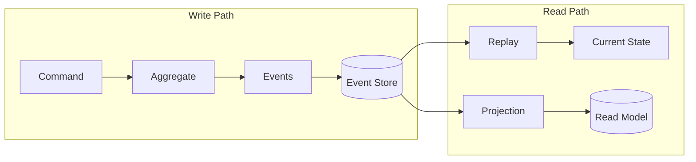
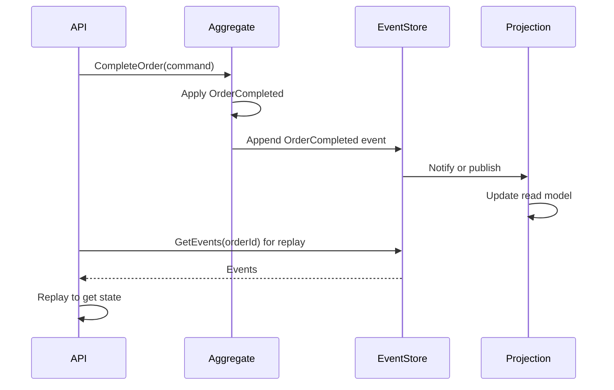

# Event Sourcing

**In a nutshell:** Instead of storing only the **current state** of an entity (e.g. “order is completed”), you store **every change as an event** (e.g. “OrderCreated,” “PaymentProcessed,” “OrderCompleted”). Current state is computed by replaying those events. You get a full history, audit trail, and a natural fit with event-driven systems and CQRS.

---

## Why This Pattern Exists

Traditional persistence overwrites state: you have an “orders” table with columns like status and total. To know what happened, you need extra audit tables or logs. **Event sourcing** flips that: the **source of truth** is the **sequence of events**. You never delete or overwrite past events; you only append. Current state is derived when you need it (e.g. by replaying events for an order). That gives you a complete history for free, makes “time travel” and debugging easier, and fits naturally with publishing events to other services (each event can be published once it’s stored). The cost is a different way of thinking (model events, not just state) and the need to maintain projections (read models) if you want to query by current state.

---

## What It Is

**Event sourcing** means:

- You don’t persist “order with status = Completed.” You persist **events**: OrderCreated, PaymentProcessed, InventoryReserved, OrderCompleted (or OrderCancelled).
- The **event store** is append-only: new events are added; old ones are not changed or removed (except for retention policies).
- To get **current state** for an aggregate (e.g. an order), you load all events for that aggregate and **replay** them (apply each event to a blank or previous state). The result is the current state.
- **Read models** (e.g. “orders list,” “order detail”) are built by **projections**: code that listens to events and updates tables or views so you can query efficiently without replaying every time.



Commands create events; events are appended. State is derived by replay or by reading from a projected read model.

---

## Use Cases

- **Audit and compliance** – You need a full history of who did what and when. Event sourcing gives you that by default; every change is an event.
- **Complex domain where “what happened” matters** – Not just “order is completed” but “payment was processed at X, inventory reserved at Y.” Replay and analytics become straightforward.
- **Integration with event-driven architecture** – The same events you store can be published to a message broker so other services react; one write, one source of truth, many consumers.
- **CQRS and read models** – The write side is event-sourced; the read side is built by projections. Very common combination.
- **Temporal queries and debugging** – “What was the state last Tuesday?” Replay events up to that point. “Why is this order in this state?” Inspect the event stream.

---

## Practical Scenarios

**Order lifecycle (like this repo’s domain)**  
Events: OrderCreated(orderId, customerId, amount, items), PaymentProcessed(orderId, paymentId), InventoryReserved(orderId, reservationId), OrderCompleted(orderId). Or OrderCancelled(orderId, reason). The aggregate “Order” has no status column in the event store; status is derived by replaying. A projection might build an “OrderSummary” table for “my orders” list.

**Banking or accounting**  
Every debit and credit is an event. Balance is derived by summing events. You get full history and easy reconciliation.

**Subscription management**  
Events: SubscriptionCreated, PlanChanged, Renewed, Cancelled. Current state (active, cancelled, plan) is derived from the stream. Billing and analytics consume the same events.

---

## How It Works

**Writing:**  
A command (e.g. “complete order”) is handled by loading the aggregate (or creating it). The aggregate produces one or more **domain events** (e.g. OrderCompleted). Those events are appended to the event store in the same transaction (or the outbox). The aggregate’s in-memory state is updated by applying the event so the next command sees the new state.

**Reading current state:**  
Option A: Load all events for the aggregate id from the event store, replay them in order, and return the resulting state. Option B: Read from a **projection** (read model) that’s updated when events are appended—faster for queries, eventually consistent.

**Projections:**  
A projection is a handler that subscribes to events (from the event store or from a message bus) and updates a read model: e.g. “On OrderCompleted, insert or update the row in OrderSummary table.” Multiple projections can build different views (orders list, dashboard stats, search index).



---

## Implementation in .NET

**Event store**  
You need an append-only store per aggregate (or global with aggregate id + version). Options: dedicated event store (EventStore DB, Greg Young’s EventStore), or a simple table:

```csharp
// Event table: Id, AggregateId, AggregateType, Version, EventType, Payload (JSON), CreatedAt
public class StoredEvent
{
    public long Id { get; set; }
    public Guid AggregateId { get; set; }
    public string AggregateType { get; set; }
    public int Version { get; set; }
    public string EventType { get; set; }
    public string Payload { get; set; }
    public DateTime CreatedAt { get; set; }
}
```

**Aggregate**  
The aggregate loads from events (replay) and produces new events when handling commands. Keep a version for optimistic concurrency.

```csharp
public class Order
{
    public Guid Id { get; private set; }
    public OrderStatus Status { get; private set; }
    private int _version;

    public static Order Create(Guid id, Guid customerId, decimal amount)
    {
        var order = new Order();
        order.Apply(new OrderCreated(id, customerId, amount));
        return order;
    }

    public void Complete()
    {
        if (Status != OrderStatus.InventoryReserved)
            throw new InvalidOperationException("Order not ready to complete");
        Apply(new OrderCompleted(Id));
    }

    private void Apply(object e)
    {
        switch (e)
        {
            case OrderCreated ev:
                Id = ev.OrderId;
                Status = OrderStatus.OrderInitiated;
                break;
            case OrderCompleted _:
                Status = OrderStatus.OrderCompleted;
                break;
                // ... other events
        }
        _version++;
    }
}
```

**Persistence:** Load events for `AggregateId`, replay into the aggregate, then when handling a command append the new events with `Version + 1`. Use version in the event store to reject concurrent writes (optimistic concurrency).

**Projections:** A background job or message consumer reads new events (from DB or broker) and updates read-model tables. Or use a library (e.g. EventStore client, or MassTransit consumers) that subscribes to the stream.

**Libraries:** EventFlow, MassTransit (with saga/event support), or a custom repository over SQL/EventStore. For learning, a simple `List<StoredEvent>` per aggregate in SQL is enough.

---

## Trade-offs and Pitfalls

**Pros:** Full history and audit trail, natural fit with events and CQRS, temporal queries, no loss of information.

**Cons:** Different mental model (events, not just state); event store can grow (consider snapshots + replay from snapshot); projections add complexity; eventual consistency for read models. Not every aggregate needs event sourcing—use it where history and events clearly add value.

**Common mistakes:** Storing only the latest state and calling it event sourcing (you need the full stream). No version/concurrency check (duplicate or overwrite events). Building read models synchronously in the write path (slow; prefer async projections). Forgetting to handle schema evolution of events (version events or use a flexible payload).

---

## Related Patterns

- [CQRS](07-cqrs.md) – Event sourcing is often the write model; projections are the read model.
- [Domain events](10-domain-events.md) – Stored events can be published as domain events for other services.
- [Saga](06-saga-pattern.md) – Choreography sagas are event-driven; events can come from an event-sourced aggregate.
- [Transactional outbox](15-transactional-outbox.md) – When you append an event and publish it, use the outbox so both happen consistently.

---

## Further Reading

- [microservices.io – Event sourcing](https://microservices.io/patterns/data/event-sourcing.html)
- Martin Fowler, [Event Sourcing](https://martinfowler.com/eaaDev/EventSourcing.html)
