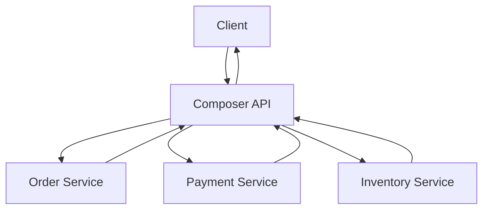

# API Composition

**In a nutshell:** When a client needs data from **several microservices** (e.g. “my orders with their payment status”), you don’t give the client access to each service’s database. Instead, a **composer** (an API or a dedicated service) **calls** those services, gets the data, and **joins or aggregates it in memory** before returning one response. Each service still owns its data; the composer is just a client of their APIs.

---

## Why This Pattern Exists

With **database per service**, no single service has all the data. The “my orders” screen might need: orders (from Order Service), payment status (from Payment Service), and maybe inventory status (from Inventory Service). The client could call three APIs and merge the results in the browser or app—but that means multiple round-trips, logic in the client, and every client repeating the same composition. **API composition** moves that job to the server: one **composer** (API or BFF) calls the backend services, does the “join” in memory, and returns a single response. The client gets one call; data ownership stays with the owning services.

---

## What It Is

**API composition** means:

- A **composer** is an API (or a Backend-for-Frontend) that implements a **query** that spans multiple services.
- The composer **calls** each owning service’s API (HTTP, gRPC) to get the data it needs.
- It **combines** the results in memory (join by id, aggregate, filter) and returns a single DTO to the client.
- No shared database: the composer is a normal client of the services; each service owns and exposes its own data.

So the flow is: Client → Composer → [Order Service, Payment Service, …] → Composer merges → Client.



The composer is the only one that “knows” how to assemble the response from multiple backends.

---

## Use Cases

- **Screens that need data from multiple domains** – “My orders” (orders + payment status), “Order detail” (order + payments + shipments), dashboards that mix orders, revenue, and inventory.
- **When you can’t or don’t want a single materialized view** – Data lives in different services and teams; you don’t want to duplicate it into one DB. Composition keeps ownership in the right place.
- **Reducing client complexity** – One API call from the client instead of N calls and client-side merging. Especially useful for mobile or thin clients.
- **Backend-for-Frontend (BFF)** – The BFF is often a composer: it calls several backend services and shapes the response for one type of client (e.g. mobile app).
- **Reports and lists** – When the report needs data from orders, payments, and products, a reporting API can compose from the respective services (or from read models that those services feed).

---

## Practical Scenarios

**“My orders” with status and last payment**  
The composer calls Order Service (GET /orders?customerId=X), then for each order (or in batch) calls Payment Service (GET /payments?orderId=Y) and maps payment status onto each order. Response: list of orders with a “payment status” field. The client doesn’t call Order and Payment separately.

**Order detail page**  
Composer calls Order Service (order by id), Payment Service (payments for that order), Inventory/Shipping Service (shipment status). Merges into one OrderDetailDto (order, payments, shipments) and returns. One request from the client.

**Admin dashboard**  
Dashboard needs: total orders today, revenue today, top products. Composer calls Order Service (count/sum), Payment Service (revenue), Product/Inventory Service (top items). Aggregates and returns a single dashboard DTO. Optionally cache the result for a short TTL.

---

## How It Works

1. **Client** calls the composer: e.g. GET /api/my-orders?customerId=...
2. **Composer** decides which services to call and with which parameters. It may call them **in parallel** (e.g. orders and payment summary) or **in sequence** (e.g. get order ids, then get payments for those ids).
3. **Services** return their data (JSON, etc.). The composer does not have DB access; it only uses public APIs.
4. **Composer** merges: match by order id, attach payment status to each order, filter or sort. Then returns one response to the client.

**Performance:** Use `Task.WhenAll` (or equivalent) to call independent services in parallel. Set timeouts and handle partial failure (e.g. if Payment Service is down, return orders without payment status and maybe a warning, or fail the whole request depending on requirements). Caching (e.g. short TTL for “my orders”) can reduce load on the backends.

---

## Implementation in .NET

**Composer as an ASP.NET Core API**  
A controller or minimal API that injects typed `HttpClient`s (or Refit clients) for each backend service, calls them, and merges.

**Example: “My orders” composition**

```csharp
[ApiController]
[Route("api/[controller]")]
public class MyOrdersController : ControllerBase
{
    private readonly IOrderServiceClient _orderClient;
    private readonly IPaymentServiceClient _paymentClient;

    public MyOrdersController(IOrderServiceClient orderClient, IPaymentServiceClient paymentClient)
    {
        _orderClient = orderClient;
        _paymentClient = paymentClient;
    }

    [HttpGet]
    public async Task<ActionResult<IEnumerable<OrderWithPaymentDto>>> GetMyOrders(
        [FromQuery] Guid customerId,
        CancellationToken ct)
    {
        // Call both services; run in parallel if independent
        var ordersTask = _orderClient.GetOrdersByCustomerAsync(customerId, ct);
        var paymentsTask = _paymentClient.GetPaymentsByCustomerAsync(customerId, ct);
        await Task.WhenAll(ordersTask, paymentsTask);

        var orders = await ordersTask;
        var payments = await paymentsTask;

        // Join in memory: for each order, find payment status
        var paymentsByOrder = payments.GroupBy(p => p.OrderId).ToDictionary(g => g.Key, g => g.ToList());
        var result = orders.Select(o => new OrderWithPaymentDto
        {
            OrderId = o.Id,
            Status = o.Status,
            Total = o.Total,
            PaymentStatus = paymentsByOrder.TryGetValue(o.Id, out var list)
                ? list.OrderByDescending(p => p.CreatedAt).First().Status
                : null
        }).ToList();

        return Ok(result);
    }
}
```

**Typed clients:** Register with `HttpClientFactory` so you get proper disposal and base addresses from config:

```csharp
builder.Services.AddHttpClient<IOrderServiceClient, OrderServiceClient>(client =>
{
    client.BaseAddress = new Uri(builder.Configuration["Services:OrderService"]));
});
```

**Refit** (optional): Define an interface and Refit generates the client; keeps the composer code clean.

**Timeouts and resilience:** Use Polly to add timeout and retry per client so one slow service doesn’t hang the composer. Consider a circuit breaker for each backend so that if Payment Service is down, you can return orders without payment info (degraded response) instead of failing the whole request.

**Caching:** For read-heavy composition (e.g. dashboard), cache the result for 30–60 seconds so repeated calls don’t hit all backends every time.

---

## Trade-offs and Pitfalls

**Pros:** Keeps data ownership in the right services, no shared DB, single round-trip for the client, flexible shape of the response.

**Cons:** Multiple network calls from the composer (latency adds up); if one backend is down or slow, the whole composition can fail or be slow. You need to design for partial failure and timeouts. For very complex or heavy queries, a dedicated read model (CQRS) might be better than live composition.

**Common mistakes:** Calling services in sequence when they could be parallel (use `Task.WhenAll`). No timeout or circuit breaker (one slow service blocks everything). Composer doing too much business logic (keep it to “call and merge”; push logic into the owning services). N+1: calling Payment Service once per order instead of a batch “payments for these order ids” if the backend supports it.

---

## Related Patterns

- [Database per service](05-database-per-service.md) – Why you need composition: each service owns its data, so you combine via APIs.
- [API Gateway](11-api-gateway.md) – The gateway can do composition for some routes, or route to a dedicated composer service.
- [CQRS](07-cqrs.md) – For heavy or complex queries, a dedicated read model (fed by events) might be better than live composition; composition is simpler for moderate needs.

---

## Further Reading

- [microservices.io – API composition](https://microservices.io/patterns/data/api-composition.html)
