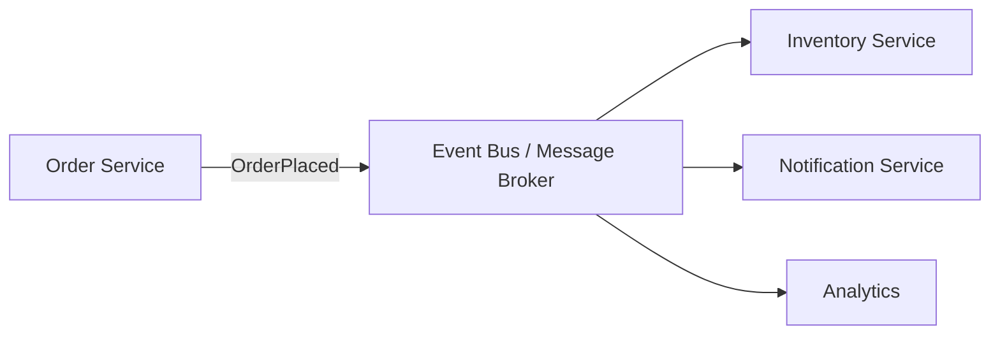

# Domain Events

**In a nutshell:** When something meaningful happens in your domain (e.g. “order placed,” “payment received”), you represent it as a **domain event** and **publish** it. Other parts of the system **subscribe** and react (update read models, send notifications, trigger the next step in a workflow)—without the publisher knowing who the subscribers are. That keeps components loosely coupled and makes it easy to add new behaviour by adding new subscribers.

---

## Why This Pattern Exists

In a monolith, after “place order” you might call notification code and inventory code directly. That creates coupling: the order module has to know about notifications and inventory. When you add “update analytics” or “start loyalty points,” you keep touching the same place. **Domain events** turn that around: the order module just says “OrderPlaced happened” and publishes an event. Whoever cares—notifications, inventory, analytics, loyalty—subscribes. The order code doesn’t depend on those subscribers; you add new behaviour by adding subscribers, not by changing the order code. In microservices, the same idea applies: one service publishes an event; others consume it and do their work. Loose coupling and extensibility.

---

## What It Is

A **domain event** is a record of **something that happened** in the domain, expressed in past tense: OrderPlaced, PaymentReceived, InventoryReserved. It usually carries the minimal data needed for subscribers (e.g. order id, customer id, amount, timestamp). The **publisher** is the code that performed the action (e.g. the order service after creating an order). **Subscribers** are handlers or services that react: they might update a read model, send an email, call another API, or publish another event. The publisher doesn’t call subscribers directly; it publishes to an **event bus** (in-process or message broker), and the bus delivers to subscribers. So the flow is: something happened → event published → subscribers notified → each subscriber does its thing.



One event, many subscribers; the publisher doesn’t know who they are.

---

## Use Cases

- **Decoupling after a state change** – Order placed → notify customer, reserve inventory, update analytics, start a saga step. The order service only publishes “OrderPlaced”; each concern is a separate subscriber.
- **Choreography sagas** – Saga steps are driven by events: OrderPlaced → Payment service charges → publishes PaymentCompleted → Inventory reserves → publishes InventoryReserved. No central coordinator.
- **Read model updates (CQRS)** – Command side publishes OrderPlaced; a subscriber updates the “my orders” read model. Same event can feed multiple projections.
- **Audit and integration** – Every important change is an event; you can log them, send them to a data lake, or forward to external systems.
- **Adding features without changing existing code** – New requirement: “when order is placed, check fraud.” Add a FraudCheck subscriber to OrderPlaced; no change to the order service’s core logic.

---

## Practical Scenarios

**Order placed**  
Order Service creates the order and publishes **OrderPlaced** (orderId, customerId, amount, items). Subscribers: Inventory Service (reserve stock), Notification Service (send “order confirmed” email), Analytics (record conversion). Payment might be a separate step (e.g. Payment Service subscribes and charges, then publishes PaymentCompleted).

**Payment completed**  
Payment Service publishes **PaymentCompleted** (orderId, paymentId, amount). Subscribers: Order Service (mark order as paid, maybe trigger next saga step), Notification (send receipt), Accounting (record revenue).

**Subscription cancelled**  
Subscription Service publishes **SubscriptionCancelled** (subscriptionId, userId, reason). Subscribers: Billing (stop charging), Access (revoke access), Notification (send “sorry to see you go” email), Analytics (churn event).

---

## How It Works

**In-process (single service)**  
After performing the action (e.g. saving the order), the code raises a domain event. A dispatcher (e.g. MediatR, or a simple list of handlers) invokes all registered handlers for that event type. Handlers run in the same process; often in the same transaction (so “save order” and “notify” can be in one unit of work, or you can defer notification to after commit).

**Cross-service (microservices)**  
The service that performed the action publishes the event to a **message broker** (RabbitMQ, Azure Service Bus, Kafka). Other services have **consumers** that receive the message and run their logic. Delivery is usually at-least-once, so consumers must be **idempotent**. To avoid losing events when the DB and the broker can’t be in one transaction, use the **transactional outbox** pattern: write the event to an outbox table in the same transaction as the business data, then a separate process publishes from the outbox to the broker.

**Event shape**  
Keep events small and stable: ids, timestamps, and the facts that subscribers need. Use a schema or version field so you can evolve the payload without breaking consumers.

---

## Implementation in .NET

**In-process with MediatR**  
Define the event and handlers in the same service. After saving the aggregate, publish the event; MediatR dispatches to all handlers.

```csharp
// Domain event
public record OrderPlaced(Guid OrderId, Guid CustomerId, decimal Amount, DateTime OccurredAt);

// Publisher (in your application service or command handler)
await _orderRepository.AddAsync(order);
await _unitOfWork.SaveChangesAsync();
await _mediator.Publish(new OrderPlaced(order.Id, order.CustomerId, order.Amount, DateTime.UtcNow));
```

```csharp
// Subscriber (handler)
public class SendOrderConfirmationHandler : INotificationHandler<OrderPlaced>
{
    private readonly IEmailSender _email;
    public async Task Handle(OrderPlaced evt, CancellationToken ct)
    {
        await _email.SendOrderConfirmationAsync(evt.OrderId, evt.CustomerId, evt.Amount, ct);
    }
}
```

Register handlers in DI; MediatR finds them by `INotificationHandler<OrderPlaced>`.

**Cross-service with MassTransit**  
Publish to a message broker so other services can consume.

```csharp
// Contract (shared or in each service)
public record OrderPlaced(Guid OrderId, Guid CustomerId, decimal Amount);

// Publisher (Order Service, after saving order)
await _publishEndpoint.Publish(new OrderPlaced(order.Id, order.CustomerId, order.Amount), ct);
```

```csharp
// Consumer (e.g. Inventory Service)
public class ReserveInventoryOnOrderPlacedConsumer : IConsumer<OrderPlaced>
{
    public async Task Consume(ConsumeContext<OrderPlaced> context)
    {
        var evt = context.Message;
        await _inventoryService.ReserveForOrderAsync(evt.OrderId, evt.Amount, context.CancellationToken);
    }
}
```

Use the **transactional outbox** when you must publish only after the DB commit: write the event to an outbox table in the same transaction as the order, then let MassTransit (or a background job) publish from the outbox. That way you don’t publish and then fail to save, or save and then fail to publish.

**Idempotency**  
Consumers may get the same event twice (retries, redelivery). Use an idempotency key (e.g. event id or order id + event type) and skip or no-op if already processed. See [Idempotent consumer](13-idempotent-consumer.md).

---

## Trade-offs and Pitfalls

**Pros:** Loose coupling, easy to add subscribers, clear “something happened” semantics, fits event-driven and CQRS architectures.

**Cons:** Flow is harder to trace (no single call stack); eventual consistency; you need to handle duplicate delivery and ordering where it matters. Don’t overuse: not every method needs to publish an event—only meaningful domain facts.

**Common mistakes:** Publishing from the domain layer with infrastructure (message broker) in the same assembly—keep domain events as plain types and let the application or infrastructure layer do the actual publish. Forgetting idempotency in consumers. Publishing too much data or volatile data (prefer ids and stable facts). No correlation id so you can’t trace a request across services.

---

## Related Patterns

- [Event sourcing](08-event-sourcing.md) – Stored events can be the same as or feed into domain events for other services.
- [Saga](06-saga-pattern.md) – Choreography sagas are driven by domain events (OrderPlaced → PaymentCompleted → InventoryReserved).
- [Transactional outbox](15-transactional-outbox.md) – Reliable publishing when the event must be consistent with the DB write.
- [Idempotent consumer](13-idempotent-consumer.md) – Subscribers must be idempotent when using a message broker.

---

## Further Reading

- [microservices.io – Domain event](https://microservices.io/patterns/data/domain-event.html)
- Martin Fowler, [Domain Event](https://martinfowler.com/eaaDev/DomainEvent.html)
