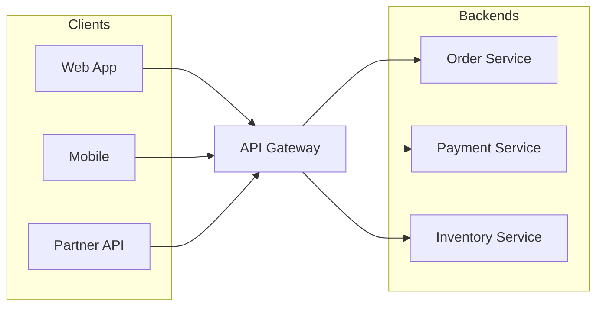

# API Gateway

**In a nutshell:** Instead of clients calling many microservices directly (and needing to know each service’s URL and auth), you put a **single entry point** in front—the **API Gateway**. It routes requests to the right backend service, can aggregate responses, and often handles auth, rate limiting, and SSL in one place. Clients talk only to the gateway.

---

## Why This Pattern Exists

In a microservice system, the client might need to call the Order Service, Payment Service, and Inventory Service for one screen. That means multiple URLs, multiple auth tokens, and the client having to know the whole topology. If you move or rename a service, every client breaks. An **API Gateway** fixes that: the client has **one** base URL (the gateway). The gateway knows which backend to call for each request (by path, header, or rule). It can also aggregate several backend calls into one response, add authentication and rate limiting in one place, and hide internal details (e.g. internal service names and ports). So the client stays simple and the system can evolve behind the gateway.

---

## What It Is

An **API Gateway** is a service that sits between **clients** (web, mobile, partners) and your **backend microservices**. It acts as a reverse proxy and sometimes as a simple orchestrator:

- **Routing** – Forwards each request to the right backend based on path (e.g. `/api/orders` → Order Service), host, or other rules.
- **Optional aggregation** – For some operations, the gateway can call several backends and combine the result (BFF-style) so the client makes one request.
- **Cross-cutting concerns** – Auth (validate JWT, attach user context), rate limiting, logging, SSL termination. Do it once at the gateway instead of in every service.
- **Hiding internals** – Clients don’t see internal hostnames or ports; they only see the gateway’s URL.



One entry point; the gateway fans out to the right services.

---

## Use Cases

- **Mobile, web, and partner clients** – They all call one host; you change backends without changing client config.
- **Central authentication** – Validate tokens at the gateway; forward user/claims to backends via headers. Backends can trust the gateway or validate again.
- **Rate limiting and throttling** – Protect backends from abuse; apply limits per API key or per user at the gateway.
- **Reducing round-trips** – For “order summary” the gateway can call Order + Payment + Inventory and return one response (aggregation), so the client doesn’t make three calls.
- **Protocol translation** – Client uses REST; gateway can call backends via gRPC or another protocol internally.
- **Strangler / migration** – Route some paths to new microservices and others to the monolith during migration.

---

## Practical Scenarios

**E-commerce**  
Client calls `GET https://api.myshop.com/orders/123`. Gateway routes `/orders/*` to Order Service. Client calls `GET https://api.myshop.com/orders/123/summary`. Gateway might call Order, Payment, and Inventory and merge into one “order summary” response. Auth: gateway validates JWT and adds `X-User-Id` (or similar) for backends.

**Multi-channel**  
Web and mobile use the same gateway. You can add a **Backend-for-Frontend (BFF)** per channel: e.g. `api.myshop.com/web/*` and `api.myshop.com/mobile/*` route to different BFFs that call the same backends but return different shapes. Or one gateway with different response transforms per client type.

**Partner API**  
Third parties get a single base URL and API key. Gateway validates the key, applies partner-specific rate limits, and routes to the same backends. You can version the partner API (`/v1/orders`) and map to current backends without exposing internal structure.

---

## How It Works

1. **Client** sends a request to the gateway (e.g. `GET /api/orders`).
2. **Gateway** applies middleware in order: auth (reject if invalid), rate limit (reject if over limit), then routing.
3. **Routing** – Gateway looks up the backend for the request (e.g. path `/api/orders` → Order Service at `http://order-service:5000`). It forwards the request (and may add or strip headers).
4. **Backend** processes and returns. Gateway forwards the response to the client. Optionally the gateway caches the response or aggregates multiple backend responses into one.
5. **Logging / metrics** – Gateway logs the request and response (and optionally traces) for observability.

For **aggregation**, the gateway acts like a small composer: it calls two or more backends (e.g. Order and Payment), merges the results, and returns one JSON. That’s useful when the client needs a combined view and you don’t want the client to do multiple calls.

---

## Implementation in .NET

**YARP (Yet Another Reverse Proxy)**  
YARP is a config-driven reverse proxy. You define routes and clusters in config (or code); YARP forwards requests and responses. Add auth and other behaviour with ASP.NET Core middleware.

**Minimal gateway with YARP:**

```csharp
var builder = WebApplication.CreateBuilder(args);
builder.Services.AddReverseProxy()
    .LoadFromConfig(builder.Configuration.GetSection("ReverseProxy"));
var app = builder.Build();
app.MapReverseProxy();
app.Run();
```

**Config example:**

```json
{
  "ReverseProxy": {
    "Routes": {
      "orders-route": {
        "ClusterId": "orders",
        "Match": { "Path": "/api/orders/{**catch-all}" }
      },
      "payments-route": {
        "ClusterId": "payments",
        "Match": { "Path": "/api/payments/{**catch-all}" }
      },
      "inventory-route": {
        "ClusterId": "inventory",
        "Match": { "Path": "/api/inventory/{**catch-all}" }
      }
    },
    "Clusters": {
      "orders": {
        "Destinations": { "default": { "Address": "https://localhost:5001" } }
      },
      "payments": {
        "Destinations": { "default": { "Address": "https://localhost:5000" } }
      },
      "inventory": {
        "Destinations": { "default": { "Address": "https://localhost:6001" } }
      }
    }
  }
}
```

So `https://gateway/api/orders` goes to Order Service; the client never sees port 5001. In production, addresses come from config or service discovery (e.g. Kubernetes DNS).

**Ocelot**  
Ocelot is another popular .NET API gateway with routing, authentication, and aggregation. You define routes in config; Ocelot handles forwarding and can call multiple backends and merge responses for aggregation routes.

**Auth at the gateway**  
Add JWT validation middleware before `MapReverseProxy()`. On success, add claims or user id to headers so backends can use them (e.g. `X-User-Id`, `X-Tenant-Id`). Backends can validate the token again or trust the gateway depending on your security model.

**Aggregation**  
For a route that needs data from several services, you can either: (1) create a dedicated “composition” or “BFF” service that the gateway routes to, and that service calls the backends (see [API composition](09-api-composition.md)), or (2) use Ocelot’s aggregation feature to define a route that calls multiple backends and merges. For non-trivial merging, a small composition service is usually clearer.

---

## Trade-offs and Pitfalls

**Pros:** Single URL for clients, central auth and rate limiting, hidden topology, optional aggregation.

**Cons:** The gateway can become a bottleneck or single point of failure (scale it and make it stateless). Complex aggregation logic in the gateway can be hard to maintain—consider a BFF or composition service. Latency adds up (one extra hop).

**Common mistakes:** Putting too much business logic in the gateway (keep it to routing, auth, and simple aggregation). No caching or rate limiting and then overloading backends. Not making the gateway stateless so it can scale horizontally.

---

## Related Patterns

- [Strangler application](04-strangler-application.md) – The gateway routes some paths to the monolith and others to new services.
- [API composition](09-api-composition.md) – The gateway can route to a composer that aggregates several backends.
- [Sync vs async messaging](12-sync-vs-async-messaging.md) – The gateway typically handles sync (HTTP) client requests; backends might use async internally.

---

## Further Reading

- [microservices.io – API Gateway](https://microservices.io/patterns/apigateway.html)
- [YARP – Yet Another Reverse Proxy](https://microsoft.github.io/reverse-proxy/)
