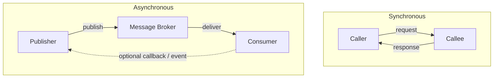

# Sync vs Async Messaging

**In a nutshell:** **Synchronous** communication means the caller sends a request and **waits** for the response (e.g. HTTP, gRPC). **Asynchronous** means the caller sends a message and **doesn’t wait** (or gets back a correlation id); the result comes later via another channel (callback, polling, or event). Each style has trade-offs: sync is simpler and gives immediate feedback; async improves resilience and scalability and fits event-driven flows. In microservices you’ll use both—sync when the user or caller needs an immediate answer, async when the work is long-running or you want loose coupling.

---

## Why This Pattern Exists

When service A needs something from service B, you have two main options. **Sync:** A calls B and blocks until B responds. Simple, but if B is slow or down, A is blocked and might run out of threads or time out; failures can cascade. **Async:** A sends a message (e.g. to a queue or topic) and continues; B processes when it can and might send a response via another message or callback. A doesn’t block on B’s availability. That improves resilience and decoupling but adds complexity: ordering, retries, idempotency, and “how does the client get the result?” So the pattern isn’t “use only sync” or “use only async”—it’s **when to use which** and how to design each style well.

---

## What It Is

**Synchronous (request–response)**  
The caller sends a request and **waits** for the response on the same connection or channel. Typical: HTTP REST, gRPC. Use when the caller needs the result to continue (e.g. “create order and return the order id,” “get user profile”). Blocking and timeouts are part of the model; you need good timeout and circuit-breaker behaviour so one slow dependency doesn’t take down the caller.

**Asynchronous (messaging / events)**  
The caller **sends** a message and does not wait (or gets only an acknowledgment or correlation id). The receiver processes later. The “response” might be: a callback URL, a correlation id the client can poll, or another event that the client (or another service) subscribes to. Use when the operation is long-running, when you don’t need an immediate response, or when you want to decouple producer and consumer (e.g. “order placed” → many subscribers). You need a message broker (RabbitMQ, Azure Service Bus, Kafka), durable delivery, and idempotent consumers for at-least-once delivery.



---

## Use Cases

**Use sync when:**  
- The user or caller needs the **result immediately** (e.g. “place order” and show success or failure, “get order by id”).  
- The operation is **fast** and the callee is usually available.  
- You want simple error handling (one call, one response, one place to handle errors).  
- You’re doing simple CRUD or a short request–response flow.

**Use async when:**  
- The operation is **long-running** (e.g. “process video,” “generate report”) and the client can poll or get a webhook later.  
- You want **resilience**: the producer shouldn’t block or fail if the consumer is slow or down.  
- You need **fan-out**: one event triggers many subscribers (e.g. OrderPlaced → inventory, notification, analytics).  
- You’re building **choreography** (saga steps driven by events) or event-driven pipelines.

---

## Practical Scenarios

**Sync: “Place order” in this repo**  
[OrderService](orchestration/Sagas.Orchestration/OrderService) calls Payment and Inventory over HTTP and returns success or failure to the client. The client waits for the full flow. Good for “I need to know right now if my order went through.” If Payment or Inventory is down, the request fails (use retries and circuit breaker to improve resilience).

**Async: “Place order” as event-driven**  
Client calls Order Service; Order Service creates the order and publishes **OrderPlaced** to a message broker, then returns “Order accepted, id = X.” Payment and Inventory services consume the event and do their work. The client might poll `GET /orders/X/status` or get a webhook when the order is completed. Order Service doesn’t block on Payment or Inventory; if they’re slow, the message waits in the queue.

**Sync: “Get order detail”**  
Client calls API; gateway or Order Service returns the order. One HTTP request, one response. Sync is the right fit.

**Async: “Send order confirmation email”**  
After order is created, you don’t need to wait for the email to be sent. Order Service publishes OrderPlaced; Notification Service consumes and sends the email. Async keeps the order path fast and decouples it from email delivery.

---

## How It Works

**Synchronous**  
1. Caller (client or service A) sends HTTP/gRPC request to callee (service B).  
2. Caller blocks (or awaits) until response or timeout.  
3. Callee processes and returns. Caller handles success or failure (retry, circuit breaker, fallback).  
Use **timeouts** (e.g. 5–10 s) and **circuit breakers** so one bad dependency doesn’t exhaust threads or hang forever.

**Asynchronous**  
1. Publisher sends a message to a **topic or queue** (e.g. OrderPlaced).  
2. Publisher gets an ack (and maybe a correlation id); it does not wait for the full processing.  
3. Consumer(s) receive the message, process (e.g. charge payment, reserve inventory), and optionally publish another event or call back.  
4. If the client needs the outcome, it either **polls** (e.g. GET /orders/{id}) or subscribes to a **webhook/callback** when the workflow completes.  
Use **idempotent consumers** and **at-least-once** delivery semantics; handle duplicates and ordering where it matters.

---

## Implementation in .NET

**Synchronous**  
Use **HttpClient** (via **IHttpClientFactory**) or **Refit** for REST; use **GrpcChannel** for gRPC. Always set timeouts and use **Polly** for retry and circuit breaker.

```csharp
// Typed client for Payment Service
builder.Services.AddHttpClient<IPaymentServiceClient>(client =>
{
    client.BaseAddress = new Uri("https://payment-service");
    client.Timeout = TimeSpan.FromSeconds(5);
}).AddPolicyHandler(GetRetryPolicy()).AddPolicyHandler(GetCircuitBreakerPolicy());
```

**Asynchronous**  
Use a message broker and a library that handles serialization, delivery, and consumers.

**MassTransit (RabbitMQ or Azure Service Bus):**

```csharp
// Publisher (Order Service)
await _publishEndpoint.Publish(new OrderPlaced { OrderId = order.Id, CustomerId = order.CustomerId }, ct);
// Return immediately; consumer will process.

// Consumer (Payment Service)
public class ProcessPaymentConsumer : IConsumer<OrderPlaced>
{
    public async Task Consume(ConsumeContext<OrderPlaced> context)
    {
        var msg = context.Message;
        await _paymentService.ChargeForOrderAsync(msg.OrderId, msg.CustomerId, context.CancellationToken);
        await context.Publish(new PaymentCompleted { OrderId = msg.OrderId });
    }
}
```

For **request–response over messaging** (e.g. client sends “create order,” wants “order created” response later), use a **correlation id**: client sends request with CorrelationId; consumer processes and publishes a response message with the same CorrelationId; client has a subscriber that matches CorrelationId and completes the wait. Or the client polls an API (GET /orders/{id}) until the order is in a terminal state.

---

## Trade-offs and Pitfalls

**Sync pros:** Simple, immediate feedback, easy to debug (one call stack). **Sync cons:** Coupling to callee availability and latency; risk of cascading failures; thread/connection usage while waiting.

**Async pros:** Decoupling, resilience (message waits in queue), fan-out, better for long-running or high-throughput flows. **Async cons:** More moving parts (broker, ordering, idempotency); “how does the client get the result?” must be designed (polling, webhook, or correlation).

**Common mistakes:** Using sync for long-running operations (client times out; use async and return “accepted” + status). Using async when the user clearly needs an immediate answer (e.g. “is my payment done?”). No timeout or circuit breaker on sync calls. No idempotency on async consumers (duplicate messages cause duplicate side effects).

---

## Related Patterns

- [API Gateway](11-api-gateway.md) – Clients usually talk to the gateway over sync (HTTP); gateway can call backends sync or trigger async flows.
- [Saga](06-saga-pattern.md) – Orchestration often uses sync (coordinator calls participants); choreography uses async (events).
- [Domain events](10-domain-events.md) – Typically async (publish to broker); in-process can be sync (dispatch to handlers).
- [Circuit breaker](14-circuit-breaker.md) – Protects sync callers when the callee is failing.
- [Idempotent consumer](13-idempotent-consumer.md) – Required for async when delivery is at-least-once.

---

## Further Reading

- [microservices.io – Remote Procedure Invocation](https://microservices.io/patterns/communication-style/rpi.html)
- [microservices.io – Messaging](https://microservices.io/patterns/communication-style/messaging.html)
