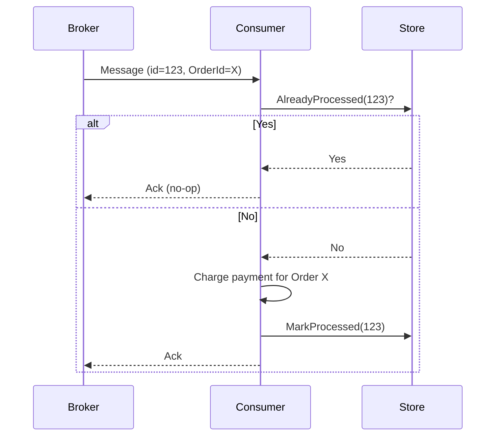

# Idempotent Consumer

**In a nutshell:** In a message-based system, the same message can be **delivered more than once** (retries, broker redelivery, at-least-once semantics). An **idempotent consumer** is one that, if it processes the same message twice, has the **same effect as processing it once**—no double charge, no double reservation. You implement that by tracking “already processed” (e.g. by message id or business key) and skipping or no-op on duplicates.

---

## Why This Pattern Exists

Message brokers often guarantee **at-least-once** delivery: they will retry if the consumer doesn’t ack, so the same message can be delivered again after a timeout or crash. If your consumer charges a payment or reserves inventory every time it runs, a duplicate delivery means **double charge** or **double reserve**—a real bug. So consumers must be **idempotent**: processing the same message twice must be safe. The usual way is to record “I already processed message X” (or “I already processed order Y for operation Z”) before or in the same transaction as the side effect, and if you see the same id again, you **don’t** apply the side effect again (or you apply it in a way that has no extra effect, e.g. “set status to Paid” instead of “add payment”).

---

## What It Is

An **idempotent consumer** is a message handler that:

- Identifies each **logical processing** by a key: e.g. message id, or (order id + operation type), or correlation id + step.
- Before doing the real work (charge, reserve, update), checks whether that key was **already processed**.
- If **yes**: returns success (or no-op) without applying the side effect again. To the broker it looks like “processed successfully.”
- If **no**: does the work, then **records** the key as processed (in the same transaction as the work if possible, or right after). Next time the same message arrives, the check sees “already processed” and skips.

So “process this message” is idempotent: once or many times, the outcome is the same.



Duplicate delivery of the same message id leads to “AlreadyProcessed” and no second charge.

---

## Use Cases

- **Any at-least-once messaging** – RabbitMQ, Azure Service Bus, Kafka (with at-least-once): redelivery is possible; consumers must be idempotent.
- **Saga steps** – “Process payment for order X” or “Reserve inventory for order X” must not run twice for the same order/step; otherwise you double-charge or double-reserve.
- **Domain event handlers** – OrderPlaced, PaymentCompleted, etc.: if the same event is delivered twice, handlers (e.g. “send confirmation email,” “update read model”) must not double-send or double-update.
- **HTTP APIs that might be retried** – If the client retries POST (e.g. “create order”) because of a timeout, the server can use an **idempotency key** (client sends a key in a header) and return the same result for the same key instead of creating a second order.

---

## Practical Scenarios

**Payment service**  
Message: “Process payment for order X, amount Y.” Consumer checks: “Have I already processed order X for this operation?” If yes, return success (payment already done). If no, charge the card and record “order X processed.” Duplicate message → “already processed” → no second charge.

**Inventory reservation**  
Message: “Reserve 2 units of SKU Z for order X.” Consumer checks by (order id + “reserve”) or by message id. First time: reserve and mark processed. Second time: “already processed,” return success without reserving again.

**Send confirmation email**  
Message: “OrderPlaced, order id X.” Consumer checks: “Have I already sent confirmation for order X?” If yes, skip. If no, send email and mark “confirmation sent for order X.” Duplicate delivery doesn’t send two emails.

**Idempotent HTTP API**  
Client sends `POST /orders` with header `Idempotency-Key: abc-123`. Server: if abc-123 was already used, return the same response (e.g. 200 with the order created earlier); don’t create a new order. Same key always maps to the same outcome.

---

## How It Works

1. **Choose the idempotency key** – Unique per “logical operation.” Options: **message id** (from the broker), **correlation id + step**, or **business key** (e.g. order id + “ProcessPayment”). Message id is simplest if one message = one logical operation.
2. **Before processing** – Look up the key in a store (table, cache). If found, consider the message already processed: log, return success, ack the message. No side effect.
3. **If not found** – Run the real logic (charge, reserve, send email). In the **same transaction** as the side effect (if possible), insert the key into the “processed” store. Then ack the message. If you can’t do it in one transaction, insert immediately after and accept a small window where a crash could allow a duplicate (or use an outbox).
4. **Cleanup** – Optionally expire old keys (e.g. after 24 hours or 7 days) so the table doesn’t grow forever. Keep the window long enough that redelivery can’t happen after you’ve deleted the key.

**Same transaction:** If “charge payment” and “mark ProcessPayment for order X as done” are in one DB transaction, you never have “charged but not marked” or “marked but not charged.” If the consumer crashes after charging but before marking, redelivery will charge again—so prefer same transaction or an outbox.

---

## Implementation in .NET

**Store processed message ids (or business keys)**  
Use a table: `ProcessedMessages` (Id, MessageId or BusinessKey, ProcessedAt). Or use a cache (Redis) with TTL. In the consumer, check then insert (or use “insert if not exists” and interpret “duplicate key” as already processed).

**Example: by message id (MassTransit)**

```csharp
public class ProcessPaymentConsumer : IConsumer<OrderPlaced>
{
    private readonly IPaymentService _paymentService;
    private readonly IProcessedMessageStore _store;

    public async Task Consume(ConsumeContext<OrderPlaced> context)
    {
        var messageId = context.MessageId.Value; // broker message id
        if (await _store.HasBeenProcessedAsync(messageId, context.CancellationToken))
        {
            // Duplicate: already processed, ack and exit
            return;
        }

        await _paymentService.ChargeForOrderAsync(context.Message.OrderId, context.Message.Amount, context.CancellationToken);
        await _store.MarkProcessedAsync(messageId, context.CancellationToken);
        // MassTransit acks when Consume returns successfully
    }
}
```

**Example: by business key (order id + operation)**

```csharp
var key = $"ProcessPayment:{context.Message.OrderId}";
if (await _store.ExistsAsync(key, ct))
    return;
await _paymentService.ChargeForOrderAsync(...);
await _store.SetAsync(key, DateTime.UtcNow, TimeSpan.FromDays(7), ct);
```

**Same transaction with side effect:** If the side effect is “insert into Payments table,” add a column or table for idempotency: e.g. `ProcessedMessageIds` and in the same `DbContext` transaction do `Payments.Add(...)` and `ProcessedMessageIds.Add(new ProcessedMessage { MessageId = messageId })`, then `SaveChangesAsync`. Then the “already processed” check is a query on that table.

**HTTP idempotency key**  
Client sends `Idempotency-Key: <uuid>` on POST. Server: before creating the order, check if that key exists in `IdempotencyKeys` (Key, ResponseStatusCode, ResponseBody, CreatedAt). If it exists, return the stored response (e.g. 200 and the same order). If not, create the order, store the key and response, then return. Use TTL to delete old keys.

---

## Trade-offs and Pitfalls

**Pros:** Safe retries and redelivery; no duplicate charges or double reservations; required for reliable sagas and event handling.

**Cons:** You need a store (DB or cache) and a cleanup strategy. Key choice matters: message id is simple but one message must equal one logical operation; business key is better when the same “operation” might be requested in different messages (e.g. two messages “process order X” → same key, process once).

**Common mistakes:** Forgetting idempotency and then seeing duplicate side effects in production. Using a key that’s too broad (e.g. “order X” for “process payment” when you might have “process payment” and “refund” as two operations—use “order X + ProcessPayment”). Deleting processed keys too soon (redelivery after TTL can cause duplicates). Not doing the “mark processed” in the same transaction as the side effect when you can (leaving a window for duplicates on crash).

---

## Related Patterns

- [Saga](06-saga-pattern.md) – Saga steps and compensations must be idempotent.
- [Domain events](10-domain-events.md) – Event handlers are consumers; they should be idempotent when using a broker.
- [Transactional outbox](15-transactional-outbox.md) – When you write “processed” and the side effect in one transaction, you avoid “did the work but didn’t record” on crash.

---

## Further Reading

- [microservices.io – Idempotent consumer](https://microservices.io/patterns/communication-style/idempotent-consumer.html)
