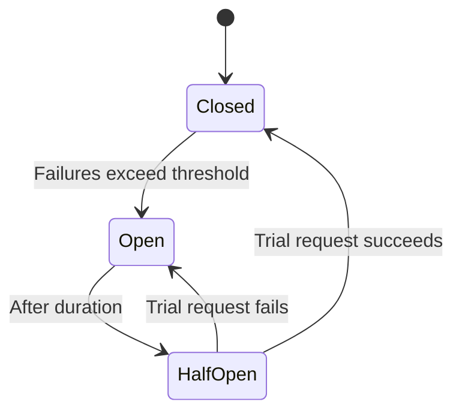

# Circuit Breaker

**In a nutshell:** When you call another service or dependency and it starts failing (timeouts, errors), repeatedly calling it can make things worse—your threads block, timeouts pile up, and the failure can spread. A **circuit breaker** wraps those calls and, after a certain number of failures, **stops calling** the dependency for a while (“opens” the circuit) and fails fast. After a cooldown it tries again (“half-open”); if that succeeds, it goes back to normal (“closed”). That protects your system and gives the failing dependency time to recover.

---

## Why This Pattern Exists

If Payment Service is down or very slow, and Order Service keeps calling it on every “create order,” you get: many requests piling up, threads waiting on timeouts, and Order Service (and maybe the whole API) becoming slow or crashing. The failure **cascades**. A **circuit breaker** breaks that loop: after N failures (or a high failure rate), it “opens” and **stops** sending requests to Payment Service for a period. Order Service gets an immediate “dependency unavailable” response instead of hanging. That fails fast, frees resources, and gives Payment Service time to recover. When the breaker tries again (half-open) and sees success, it “closes” and normal calls resume. So the pattern is about **failing fast** and **not hammering** a dependency that’s already failing.

---

## What It Is

A **circuit breaker** is a wrapper (or policy) around outbound calls to a dependency. It has three states:

- **Closed** – Normal operation. Calls go through to the dependency. Failures are counted (or failure rate is measured).
- **Open** – Too many failures (count or rate above threshold). The breaker **does not** call the dependency; it immediately returns an error (or a fallback) to the caller. After a **duration** (e.g. 30 seconds), it moves to **half-open**.
- **Half-open** – The breaker allows **one or a few** trial requests. If they succeed, the breaker assumes the dependency recovered and goes back to **closed**. If they fail, it goes back to **open** for another cooldown.

So: closed → (failures exceed threshold) → open → (after duration) → half-open → (trial success) → closed, or (trial failure) → open.



Calls in **open** state don’t touch the dependency; they fail immediately (or return a fallback), so your system doesn’t block or cascade.

---

## Use Cases

- **Protecting callers when a downstream service or DB is failing** – So the caller doesn’t exhaust threads or time out on every request.
- **Protecting a failing service from more load** – Stopping the flood of retries gives it time to restart or scale.
- **Any synchronous call to another service or external API** – HTTP calls to Payment Service, Inventory Service, or a third-party API are good candidates.
- **Database or cache calls** – If the DB is slow or down, a circuit breaker on the DB call can fail fast and let the API return “degraded” or 503 instead of hanging.

---

## Practical Scenarios

**Order Service calling Payment Service**  
On “create order,” Order Service calls Payment Service. If Payment is down, the first few calls time out or return 5xx. After 5 failures (or 50% failure rate), the circuit **opens**. Subsequent “create order” requests get an immediate error: “Payment service temporarily unavailable.” Order Service can return 503 or a clear message to the user. After 30 seconds the breaker goes **half-open**, allows one request; if it succeeds, the circuit **closes** and normal flow resumes. If it fails, circuit opens again.

**API calling external provider**  
Your API calls a third-party (e.g. shipping rates). If the third-party is slow or down, open the circuit so you don’t pile up timeouts. Return a cached value or “shipping unavailable” until the circuit closes.

**Service calling database**  
If the DB is overloaded or unreachable, circuit breaker on the DB call fails fast so the API can return quickly (e.g. 503) instead of holding connections and timing out.

---

## How It Works

1. **Wrap** every call to the dependency (e.g. Payment Service) with the circuit breaker policy.
2. **On each call** – If state is **closed**, execute the call. On success, optionally reset the failure count. On failure (exception or non-2xx), increment count (or update failure rate). If count (or rate) exceeds threshold, **open** the circuit.
3. **When open** – Don’t call the dependency; immediately throw (or return fallback). Optionally start a timer for the cooldown.
4. **After cooldown** – Switch to **half-open**. Allow the next call (or a few) through. If it succeeds, **close** the circuit. If it fails, **open** again and restart the cooldown.

Thresholds (how many failures, how long open, how many trials in half-open) are configurable. Typical: 5 failures or 50% failure rate, 30 s open, 1 trial in half-open.

---

## Implementation in .NET

**Polly** is the standard library for circuit breakers (and retry) in .NET. Use `CircuitBreakerPolicy` or `CircuitBreakerAsyncPolicy` and wrap your `HttpClient` or the call site.

**Circuit breaker policy:**

```csharp
using Polly;
using Polly.CircuitBreaker;

var circuitBreaker = Policy
    .Handle<HttpRequestException>()
    .OrResult<HttpResponseMessage>(r => !r.IsSuccessStatusCode)
    .CircuitBreakerAsync(
        handledEventsAllowedBeforeBreaking: 5,   // open after 5 failures
        durationOfBreak: TimeSpan.FromSeconds(30),
        onBreak: (outcome, duration) => { /* log */ },
        onReset: () => { /* log */ },
        onHalfOpen: () => { /* log */ });
```

**Use with HttpClient (delegating handler):**

```csharp
builder.Services.AddHttpClient<IPaymentServiceClient>(client =>
{
    client.BaseAddress = new Uri("https://payment-service");
})
.AddPolicyHandler(circuitBreaker);
```

Then every call made with that `HttpClient` goes through the circuit breaker. When the circuit is open, the policy throws `BrokenCircuitException` (or similar) so your code can catch it and return 503 or a friendly message.

**Combine retry and circuit breaker:**  
Retry a few times (e.g. 2 retries with backoff), then let the circuit breaker see the failure. So: retry 2 times → if still failing, that counts toward the circuit; after 5 such failures, open the circuit. That way you don’t open on the first blip, but you do open when the dependency is really down.

```csharp
var retry = Policy
    .Handle<HttpRequestException>()
    .WaitAndRetryAsync(2, attempt => TimeSpan.FromSeconds(Math.Pow(2, attempt)));

builder.Services.AddHttpClient<IPaymentServiceClient>(...)
    .AddPolicyHandler(retry)
    .AddPolicyHandler(circuitBreaker);  // retry first, then circuit breaker
```

**Fallback (optional):** When the circuit is open, you can return a default (e.g. “Payment unavailable, try later”) instead of throwing. Use `Policy.Wrap(fallback, circuitBreaker)` or handle `BrokenCircuitException` in your code and return a fixed response.

---

## Trade-offs and Pitfalls

**Pros:** Stops cascading failures, fails fast, gives the dependency time to recover, improves overall stability.

**Cons:** While the circuit is open, valid requests that would have gone to that dependency also fail (by design). You need good logging and monitoring so you know when the circuit opens and when it closes.

**Common mistakes:** Not using a circuit breaker at all and then seeing cascading failures. Opening too aggressively (e.g. after 1 failure—use a small threshold or failure rate). Not combining with retry (a single transient failure shouldn’t open the circuit; a few retries then failure is a better signal). Not logging or alerting when the circuit opens so ops can notice.

---

## Related Patterns

- [Sync vs async messaging](12-sync-vs-async-messaging.md) – Circuit breaker applies to synchronous calls; async messaging has different failure modes (queue backup, consumer down).
- [Saga](06-saga-pattern.md) – When the saga coordinator calls participants over HTTP, wrap those calls with retry and circuit breaker so one bad participant doesn’t hang or crash the coordinator.

---

## Further Reading

- [microservices.io – Circuit breaker](https://microservices.io/patterns/reliability/circuit-breaker.html)
- [Polly – Circuit breaker](https://www.thepollyproject.org/)
