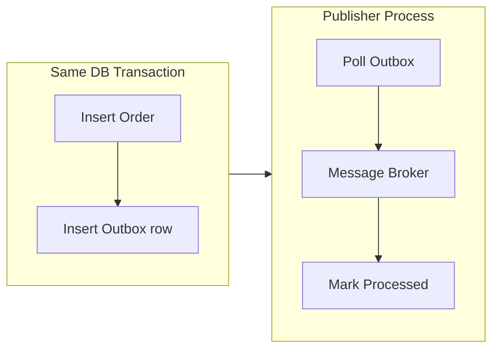

# Transactional Outbox

**In a nutshell:** When your service must **update the database** and **publish a message** (e.g. a domain event) in a way that feels “atomic,” you can’t always do both in one distributed transaction. The **transactional outbox** pattern fixes that: you write the **outgoing message** into an **outbox table** in the **same database transaction** as your business data. A separate process then reads from the outbox and **publishes** to the message broker. So you never have “saved to DB but failed to publish” or “published but then rolled back the DB”; every committed row in the outbox will eventually be published.

---

## Why This Pattern Exists

A typical flow: “Save the order and publish OrderPlaced so other services can react.” If you save the order and then publish, and the publish fails (broker down, network issue), you have an order in the DB but no event—subscribers never see it. If you publish first and then save, and the save fails, you have an event in the broker but no order—wrong. You can’t put “commit in SQL” and “publish to RabbitMQ” in one true transaction across two systems. The **transactional outbox** solves it: the only thing you do in the **same** transaction as the order is **insert a row** into an **outbox** table that says “publish this message.” So the atomic unit is: “order + outbox row” in one DB transaction. A separate **publisher** process (or job) reads unprocessed outbox rows and publishes them to the broker, then marks them as sent. So: if the transaction commits, the outbox row is there and will eventually be published; if the transaction rolls back, there’s no outbox row and nothing is published. No dual-write inconsistency.

---

## What It Is

**Transactional outbox** means:

1. You have an **outbox table** in the **same database** as your business data (e.g. Orders). Columns might be: Id, AggregateType, AggregateId, EventType, Payload (JSON), CreatedAt, ProcessedAt (null = not yet published).
2. In the **same transaction** as the business write (e.g. insert Order), you **insert a row** into the outbox with the message (event) you want to publish. Then you commit. So either both the order and the outbox row are committed, or neither.
3. A **separate process** (poller, or log tailer, or library) **reads** outbox rows where ProcessedAt is null, **publishes** each to the message broker, and then **marks** the row as processed (set ProcessedAt or delete the row). It runs periodically or in real time.
4. The broker delivers to consumers. So “order committed” and “event published” are eventually consistent: the event will be published after the transaction commits.



No direct “publish” in the request path; only “write to outbox.” The publisher process does the actual publish.

---

## Use Cases

- **Publishing domain events** when something is saved – e.g. after saving an order, you want to publish OrderPlaced. The event must not be lost if the broker is temporarily down, and you must not publish if the order wasn’t committed. Outbox gives both.
- **Saga or choreography** – The first step (e.g. “create order”) saves state and must notify the next step via a message. Outbox ensures the message is published exactly once per committed order (publisher is idempotent or processes each row once).
- **Any “write to DB and notify”** flow where you need consistency – Notifications, integration events, audit events. If the notification is critical, put it in the outbox so it’s not lost.

---

## Practical Scenarios

**Order Service**  
When an order is created, you insert into `Orders` and insert into `Outbox` (EventType: OrderPlaced, Payload: JSON with order id, customer id, amount). Commit. A background job selects from Outbox where ProcessedAt is null, publishes each to RabbitMQ (or Azure Service Bus), then sets ProcessedAt. Consumers (Payment, Inventory, Notifications) receive OrderPlaced. If the broker was down when the job ran, the row stays unprocessed and the job will retry; no event is lost.

**Payment Service**  
After recording a payment, insert into `Payments` and into `Outbox` (PaymentCompleted). Same pattern: one transaction, then publisher sends to the broker. Saga or read-model consumers get the event reliably.

**User registration**  
Insert User and Outbox (UserRegistered). Publisher sends to broker. Welcome-email service and analytics consume. No “user saved but welcome email never sent” because the outbox row guarantees the event will be published.

---

## How It Works

1. **Request** – “Create order.” Application starts a DB transaction.
2. **In the transaction** – Insert the order (or update aggregate). Insert one or more rows into the outbox (one row per message/event). Commit. So order and outbox rows are committed together.
3. **Publisher** – Runs on a schedule (e.g. every second) or is triggered. It selects from Outbox where ProcessedAt is null (and optionally orders by Id for FIFO). For each row, it publishes the Payload (or EventType + Payload) to the broker. After successful publish, it updates ProcessedAt = UTC now (or deletes the row). If publish fails, it leaves the row unprocessed and will retry on the next run.
4. **Consumers** – Receive messages from the broker as usual. They should be **idempotent** in case the publisher sends the same outbox row twice (e.g. broker ack lost); typically you process each outbox row once and then mark it, so duplicates are rare if the publisher is careful.

**Ordering:** If you need messages for the same aggregate to be processed in order, publish in the order of Outbox.Id (or CreatedAt) and use a single-threaded publisher per aggregate type, or use a broker that preserves order per partition/key.

---

## Implementation in .NET

**Outbox table (EF Core):**

```csharp
public class OutboxMessage
{
    public long Id { get; set; }
    public string AggregateType { get; set; }
    public Guid AggregateId { get; set; }
    public string EventType { get; set; }
    public string Payload { get; set; }
    public DateTime CreatedAt { get; set; }
    public DateTime? ProcessedAt { get; set; }
}

// In your DbContext
public DbSet<OutboxMessage> Outbox => Set<OutboxMessage>();
```

**Same transaction as the order:**

```csharp
await using var tx = await _db.Database.BeginTransactionAsync(ct);
try
{
    _db.Orders.Add(order);
    _db.Outbox.Add(new OutboxMessage
    {
        AggregateType = "Order",
        AggregateId = order.Id,
        EventType = "OrderPlaced",
        Payload = JsonSerializer.Serialize(new OrderPlacedEvent(order.Id, order.CustomerId, order.Amount)),
        CreatedAt = DateTime.UtcNow
    });
    await _db.SaveChangesAsync(ct);
    await tx.CommitAsync(ct);
}
catch
{
    await tx.RollbackAsync(ct);
    throw;
}
```

**Publisher (background service):**

```csharp
public class OutboxPublisherService : BackgroundService
{
    private readonly IServiceProvider _sp;
    private readonly ILogger<OutboxPublisherService> _log;

    protected override async Task ExecuteAsync(CancellationToken stoppingToken)
    {
        while (!stoppingToken.IsCancellationRequested)
        {
            await using var scope = _sp.CreateAsyncScope();
            var db = scope.ServiceProvider.GetRequiredService<OrderDbContext>();
            var bus = scope.ServiceProvider.GetRequiredService<IPublishEndpoint>(); // MassTransit

            var pending = await db.Outbox
                .Where(m => m.ProcessedAt == null)
                .OrderBy(m => m.Id)
                .Take(100)
                .ToListAsync(stoppingToken);

            foreach (var msg in pending)
            {
                try
                {
                    var evt = JsonSerializer.Deserialize<OrderPlacedEvent>(msg.Payload);
                    await bus.Publish(evt, stoppingToken);
                    msg.ProcessedAt = DateTime.UtcNow;
                }
                catch (Exception ex)
                {
                    _log.LogWarning(ex, "Failed to publish outbox {Id}", msg.Id);
                    break; // retry next run
                }
            }
            await db.SaveChangesAsync(stoppingToken);
            await Task.Delay(1000, stoppingToken);
        }
    }
}
```

Register the publisher as a hosted service. Use the same DbContext (or a scoped one) so ProcessedAt is updated in the same DB.

**Libraries:** **NServiceBus** and **MassTransit** have built-in outbox support (they create the table and the publisher for you when you use their outbox with EF Core). That reduces boilerplate; you still follow the same idea: write to outbox in the same transaction, separate process publishes.

---

## Trade-offs and Pitfalls

**Pros:** No “saved but not published” or “published but rolled back”; at-least-once delivery to the broker; simple mental model (one transaction = order + outbox row).

**Cons:** Eventual consistency: there’s a delay between commit and publish (usually seconds). The publisher must be reliable (retry, idempotent publish if needed). Outbox table grows—archive or delete processed rows after a retention period.

**Common mistakes:** Publishing directly in the request path instead of writing to the outbox (then when publish fails, you’re inconsistent). Not running the publisher (so outbox rows never get published). Processing the same row twice (publisher should mark processed only after successful publish, and use a single consumer per row or locking so two instances don’t process the same row). Not using the same transaction for business data and outbox (then a crash can leave order without outbox row or vice versa).

---

## Related Patterns

- [Domain events](10-domain-events.md) – Events are often published via the outbox when they must be consistent with the DB write.
- [Saga](06-saga-pattern.md) – Saga steps that “save and publish” (e.g. create order and publish OrderPlaced) use the outbox so the message isn’t lost.
- [Idempotent consumer](13-idempotent-consumer.md) – Consumers of outbox-published messages should be idempotent in case of duplicate delivery (e.g. publisher retries).

---

## Further Reading

- [microservices.io – Transactional outbox](https://microservices.io/patterns/data/transactional-outbox.html)
