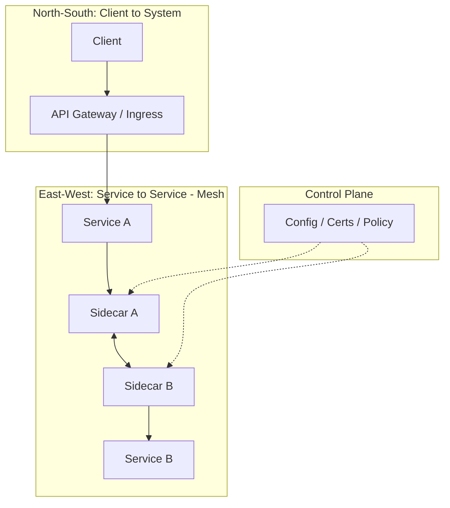
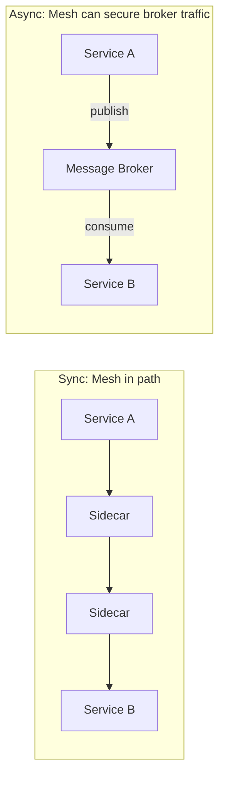
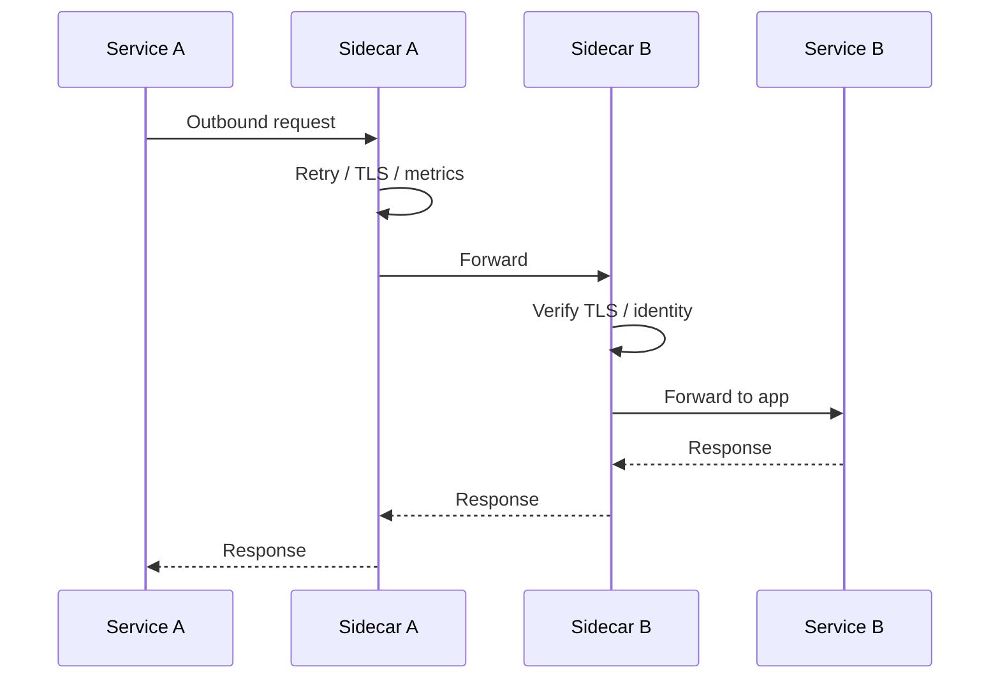

# Service Mesh

**In a nutshell:** A **service mesh** is infrastructure that handles **service-to-service** communication (traffic, security, observability) in a consistent way using **sidecar proxies** (or the equivalent) so your application code does not have to implement retries, TLS, or tracing in every service.

---

## Why This Pattern Exists

In a microservice system, every service might call several others over the network. If each team adds its own retries, timeouts, circuit breakers, TLS, and tracing, you get inconsistency, duplicated code, and gaps when a service is written in another language or framework. A **service mesh** moves those concerns into a **dedicated infrastructure layer**: a small proxy (the “sidecar”) runs next to each service instance and intercepts all inbound and outbound traffic. The mesh applies retries, TLS (often mTLS), and reports metrics and traces for every call, without the application knowing. So you get consistent, secure, and observable service-to-service communication in one place, and your apps stay focused on business logic.

---

## What It Is

A **service mesh** is a dedicated infrastructure layer for **east–west** traffic—that is, **service-to-service** traffic inside your system. It does **not** replace the API Gateway, which handles **north–south** traffic (clients talking to your system). The mesh sits between your services: when Order Service calls Payment Service, the request goes through a proxy beside Order Service, then through a proxy beside Payment Service, and only then to Payment Service itself. Those proxies are configured by a central **control plane** so that retries, TLS, routing, and observability are applied uniformly.

**Main components:**

- **Data plane** – The proxies (e.g. Envoy, Linkerd’s proxy) that run next to each service instance (pod or VM). They handle every request to and from the service: TLS termination or passthrough, retries, timeouts, and they emit metrics and traces. Your app sends traffic to “localhost” or the sidecar; the sidecar forwards to the real destination.
- **Control plane** – A set of components that configure the proxies: routing rules, retry policies, certificates for mTLS, and service discovery. Examples: Istio (Istiod), Linkerd (destination), Consul Connect. The control plane pushes configuration to the data plane; it does not sit in the request path.

The mesh applies to **east–west** traffic (Service A ↔ Service B). Client-to-gateway is usually handled by the API Gateway or ingress, not by the mesh (though some meshes can also manage ingress).

---

## Why Is It Used?

- **Consistent behaviour without app changes** – Retries, timeouts, and circuit breaking can be applied to all service-to-service calls in one place. Developers don’t need to add Polly, custom HttpClient config, or tracing in every .NET service; the mesh does it at the proxy.
- **Security** – The mesh can turn on **mTLS** (mutual TLS) between services automatically: every call is encrypted and each side is authenticated. You can also enforce policy (e.g. “Service A may only call Service B and C”) at the mesh instead of in each app.
- **Observability** – The mesh generates metrics (latency, error rate, throughput) and often propagates trace headers for every service-to-service call. You get a consistent view of east–west traffic without instrumenting every codebase.
- **Traffic management** – Canary releases, blue/green, and fault injection can be done at the mesh by routing a percentage of traffic to a new version. No code change in the callers.
- **Operational clarity** – One place to define and evolve policies (security, resilience, routing) across many services and languages. New services get the same behaviour as soon as they’re in the mesh.

---

## Use Cases

- **Zero-trust / mTLS everywhere** – Encrypt and authenticate all service-to-service calls without each team implementing TLS in their own services. The mesh issues and rotates certificates and configures the proxies.
- **Uniform retries, timeouts, circuit breaking** – Same policies for all synchronous calls (HTTP, gRPC) between services, regardless of language or framework. Reduces “this service has retries, that one doesn’t” inconsistencies.
- **Observability (metrics and tracing)** – Get latency percentiles, error rates, and distributed traces for east–west traffic without changing application code. Helpful when you have many services and mixed runtimes.
- **Canary and gradual rollout** – Shift a percentage of traffic from v1 to v2 at the mesh layer (e.g. 10% to the new version). Callers don’t need to know; the mesh routes by rule.
- **Multi-cluster or hybrid** – Connect services across Kubernetes clusters or between cloud and on-prem with consistent security and routing. Some meshes support multi-cluster out of the box.
- **Policy and compliance** – Enforce “Service A can only talk to B and C” or “all traffic must be encrypted” centrally. Auditors see policy in one place.

---

## Why Do We Need a Service Mesh If We Have Async Events (Published/Consumed)?

Many systems use **async messaging** (e.g. RabbitMQ, Kafka) for events: services publish and consume instead of calling each other directly. So the question is: do we still need a mesh?

**The mesh applies to the transport you use.**

- **Synchronous (HTTP/gRPC):** When Service A calls Service B directly, that traffic goes through the mesh (sidecar to sidecar). Retries, TLS, observability, and circuit breaking are handled by the mesh. The mesh is very relevant here.
- **Asynchronous (message broker):** Service A **publishes** to a broker; Service B **consumes** from the broker. There are no direct A-to-B calls. But the **connections from A to the broker** and **from B to the broker** are still network traffic. If that traffic goes through the mesh (e.g. the broker is in the same cluster and traffic is intercepted by sidecars), the mesh can still provide TLS to the broker, metrics for “publish latency” and “consume latency,” and retries for the connection. So the mesh doesn’t disappear when you use async—it can still secure and observe **service-to-broker** traffic.

**What the mesh does *not* replace:**  
The mesh does **not** replace the message broker. It does **not** guarantee at-least-once delivery, ordering, or dead-letter behaviour for messages—that’s the broker’s job. The mesh operates at the **network/transport** level (TCP, HTTP); the broker operates at the **application** level (messages, queues, topics). They solve different problems.

**So do we “need” a mesh when we have async?**

- **If most of your service-to-service communication is async** (services only talk to the broker): The main value of the mesh is less about “every service-to-service call” (because there are fewer direct calls) and more about: (1) securing and observing **traffic to and from the broker**, (2) any **remaining sync** calls (e.g. Order Service calling Payment API for a quick status check), and (3) **north–south** traffic if the mesh is used for ingress. You might still use a mesh for consistency (TLS to broker, tracing, policy), or you might rely more on broker-side security and app-level instrumentation. It’s a trade-off.
- **If you have both sync and async:** The mesh is very useful for all the **sync** call paths. For **async**, it **complements** the broker (transport security, connection metrics) rather than replacing it. You can use both.

**Short takeaway:** A service mesh addresses **transport-level** concerns (resilience, TLS, observability) on **service-to-service and service-to-broker** traffic. Async events address **application-level** concerns (decoupling, ordering, delivery guarantees). They work at different layers; you can use both. You “need” a mesh when you want those transport-level benefits to be consistent and code-free across services. Async events don’t remove that need for the traffic that still exists—sync calls and connections to the broker.

---

## How It Works

1. **Request path:** Service A makes an outbound call (e.g. HTTP to Service B). The call is intercepted by A’s **sidecar proxy**. The proxy looks up the destination (service discovery), applies policies (retry, timeout, TLS), and forwards the request to **B’s sidecar**. B’s sidecar verifies TLS and identity, then forwards to Service B. The response follows the same path in reverse.
2. **Control plane:** The control plane watches the cluster (e.g. Kubernetes), issues certificates, and pushes configuration to each sidecar: “Service B is at these endpoints,” “use mTLS,” “retry 3 times with backoff.” The proxies don’t need app code changes; they get their config from the control plane.
3. **Observability:** Each proxy reports metrics (request count, latency, status codes) and often injects or forwards trace headers (e.g. W3C Trace Context). A central observability stack (Prometheus, Jaeger, etc.) collects this so you see service-to-service traffic without app instrumentation.

---

## Implementation Notes

**Kubernetes-centric:** Most service meshes (Istio, Linkerd, Consul Connect) are designed for Kubernetes. They inject a **sidecar container** into each pod next to your application container. Your .NET service runs as usual; the sidecar handles traffic transparently. You enable the mesh by labelling namespaces or pods for injection; no change to your .NET code is required for basic traffic, TLS, or metrics.

**Example (conceptual):** A pod might have two containers—your app and the proxy. The app’s outbound traffic is routed to the proxy (e.g. via iptables or the app binding to the proxy). The mesh control plane configures the proxy based on Kubernetes resources (Service, Pod, VirtualService in Istio, etc.).

**Alternatives:** Some teams use **library-based** approaches instead of a mesh: consistent use of Polly (retry, circuit breaker), OpenTelemetry (tracing), and HttpClient configuration in every .NET service. That works well for smaller or homogeneous (.NET-only) stacks. A mesh shines when you have **many services**, **multiple languages**, or you want to enforce policy and observability **without changing every codebase**. The trade-off is operational complexity (control plane, upgrades, sidecar resource cost) versus consistency and “zero code” for transport behaviour.

---

## Trade-offs and Pitfalls

**Pros:** Consistent security (mTLS) and resilience (retries, circuit breaking) across services; rich observability with little or no app code; traffic management (canary, routing) in one place; works across languages.

**Cons:** Added complexity (control plane, upgrades, troubleshooting). Resource cost: every pod has a sidecar (extra CPU/memory). Learning curve for operators. Not every system needs a full mesh—small or simple deployments might be fine with libraries and an API Gateway.

**Pitfalls:** Adopting a mesh too early before you have enough services or pain to justify it. **Double retries:** if the mesh retries and your app also retries, you can get more retries than intended; align policies or disable one layer. Ignoring the cost of running and upgrading the control plane. Assuming the mesh replaces the need for good application design (e.g. idempotency, timeouts in app logic)—it doesn’t; it handles transport.

---

## Related Patterns

- [API Gateway](11-api-gateway.md) – Handles **north–south** traffic (clients to your system). The service mesh handles **east–west** traffic (service to service). They complement each other.
- [Circuit breaker](14-circuit-breaker.md) – The mesh can implement circuit breaking at the proxy so failing services don’t get hammered. Your app can still use Polly for app-level control or when not using a mesh.
- [Sync vs async messaging](12-sync-vs-async-messaging.md) – The mesh applies to the transport layer (including connections to the broker). Async messaging is an application-level pattern; mesh and async address different layers and can be used together.

---

## Further Reading

- [Istio – What is a service mesh?](https://istio.io/latest/docs/concepts/what-is-istio/)
- [Linkerd – What is a service mesh?](https://linkerd.io/what-is-a-service-mesh/)
- [Consul – Service mesh](https://www.consul.io/docs/connect)
- [CNCF – Service mesh](https://www.cncf.io/blog/2017/04/26/service-mesh/)
