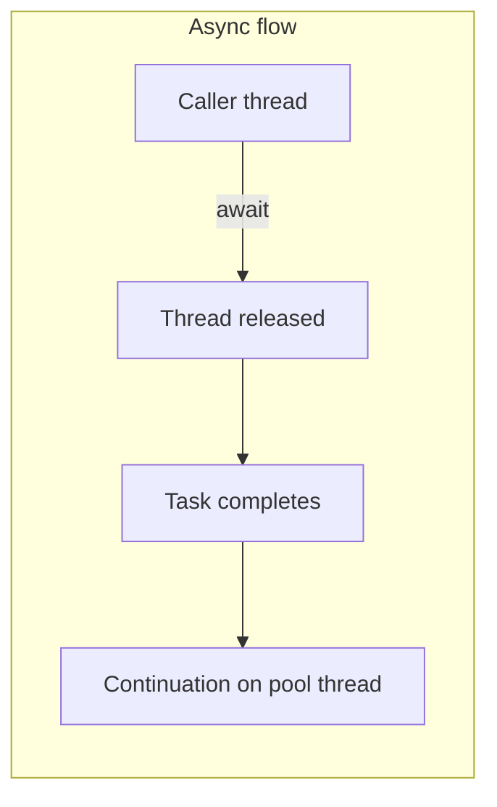

# Async/Await in C#

A concise guide to what async/await is, how it works under the hood, where and how to use it, and what happens with long-running operations.

---

## What Is Async/Await and Why It Exists

**The problem.** When you wait for I/O—an HTTP call, a database query, reading a file—a thread that just sits there waiting is wasted. Threads are a limited resource. If every request blocks a thread for the whole duration of a slow external call, you run out of threads and your server can’t handle more work, even though the CPU is mostly idle. Blocking a thread while waiting for I/O is bad for scalability.

**The idea.** With async/await, an “async” method returns a **task** that represents work that’s already in progress. **Await** means: “When that work completes, continue from here”—but *without* blocking a thread while waiting. The thread that hit `await` is released back to the thread pool. When the awaited operation (e.g. the HTTP response) arrives, a thread is used to run the rest of the method. So you get concurrency (many operations in flight) without dedicating one thread per operation.

**The contract.** An `async` method returns `Task` (for “fire and forget”) or `Task<T>` (for “return a value”). You **await** those tasks. Awaiting yields control and frees the current thread until the task completes; then execution continues after the `await`.

**Sync vs async: one example.** If you did this synchronously, a thread would block until the response arrived. With async, the thread is released while waiting:

```csharp
// Thread is released while waiting for the response; continuation runs when it arrives
string json = await httpClient.GetStringAsync(url);
```

Same logical “get a string” operation, but the async version doesn’t hold a thread during the wait.

---

## What Happens Under the Hood

**State machine.** The compiler rewrites an `async` method into a **state machine**. Your method is effectively split into chunks: “everything before the first await,” “everything between first and second await,” and so on. When you hit `await`, the current chunk finishes and the method “returns” (to the caller or to the scheduler). When the awaited task completes, the state machine is resumed and the next chunk runs. Local variables are kept in the state machine so they’re still there when execution continues. You don’t need to look at the generated IL; the important idea is: **method is split into chunks; after each await we return, and later we continue from the next chunk.**

**Threads.** The thread that was executing your method does **not** stay blocked on the `await`. It goes back to the thread pool (or wherever it came from). The wait is represented by a `Task` that completes when the underlying I/O finishes. When that happens, a **continuation** is scheduled—often on a thread-pool thread—and your method continues from the next line. So a 2-minute HTTP call does **not** tie up a thread for 2 minutes; the thread is released during the wait.

**SynchronizationContext.** In UI apps (e.g. WPF, WinForms), there is a synchronization context that marshals continuations back to the UI thread, so you don’t update the UI from a background thread. In **ASP.NET Core** there is no synchronization context; continuations run on thread-pool threads, and you don’t need to “get back” to a specific thread. So in a web app, after an `await` you may be on a different thread than before—that’s expected and fine.

**What happens when there are 3 await calls in one method?** The same idea scales. The compiler generates a state machine with multiple states: one for “before first await,” one for “between first and second await,” one for “between second and third await,” and one for “after third await.” Execution runs like this:

1. **Chunk 0** runs (everything up to the first `await`). The first async operation is started. When you hit `await`, the method returns a task to the caller and the **thread is released**.
2. When the **first** task completes, a continuation is scheduled. A thread (often from the pool) runs **Chunk 1** (code between first and second `await`). The second async operation is started. At the second `await`, the method yields again and the **thread is released**.
3. When the **second** task completes, a continuation runs **Chunk 2** (code between second and third `await`). The third async operation is started. At the third `await`, the **thread is released** again.
4. When the **third** task completes, a continuation runs **Chunk 3** (the rest of the method) and the method’s return value is set.

So with three awaits you get **three** “release thread, then resume” cycles. No single thread is blocked for the whole duration. Local variables live in the state machine, so they’re still there when each chunk runs. The thread that runs Chunk 1 might be different from the one that ran Chunk 0, and so on—that’s normal.

Example:

```csharp
public async Task<OrderResult> CreateOrderAsync(Order order, CancellationToken ct)
{
    var user = await _userService.GetUserAsync(order.UserId, ct);   // await 1: thread released
    if (user == null) throw new NotFoundException();

    await _inventoryService.ReserveAsync(order.Items, ct);          // await 2: thread released again
    var payment = await _paymentService.ChargeAsync(order.Total, ct); // await 3: thread released again

    return new OrderResult { OrderId = order.Id, Charged = payment.Amount };
}
```

Each `await` yields; when that operation completes, the next chunk runs. Three I/O operations, three chances for the thread to be released—so you never hold a thread idle across all three waits.




---

## Where to Use Async/Await

**Use for:** I/O-bound work. HTTP calls, database queries, file I/O, calls to external APIs—anything where the CPU is mostly waiting on something else. If an API returns `Task` or `Task<T>`, you should await it (and your method should be `async` and return `Task`/`Task<T>`).

**Use with care for CPU-bound work.** Async/await does not magically move CPU work to a background thread. If you have heavy computation, use `Task.Run` to offload it to a thread-pool thread and await that task, or use another pattern. Wrapping CPU-bound code in `async` without offloading just adds overhead.

**Don’t:** Block on async code with `.Result` or `.Wait()`. On a context that only allows one thread at a time (e.g. UI), that can cause a deadlock: the thread is waiting for the task, and the task needs that same thread to complete. Prefer async all the way. Also avoid `async void` except for top-level event handlers; with `async void` you can’t await the method and exceptions are harder to handle.

**Rule of thumb:** If it’s I/O and it returns a `Task`, await it.

---

## How to Use It — Syntax and Examples

**Method signatures.**

- `async Task` — no return value; caller can await for completion.
- `async Task<T>` — returns a value of type `T`; caller gets it via `await`.
- `async ValueTask<T>` — like `Task<T>` but can avoid heap allocation when the result is often available synchronously; use when it makes sense for hot paths.

  ```csharp
  public async ValueTask<Customer?> GetCachedOrFetchAsync(Guid id, CancellationToken ct)
  {
      if (_cache.TryGetValue(id, out var customer))
          return customer;  // synchronous path, no allocation
      return await FetchFromDbAsync(id, ct);
  }
  ```

**Awaiting.** `var result = await SomeAsync();` — control returns to the caller until the task completes, then execution continues with `result` set.

**Example: async HTTP.**

```csharp
var response = await httpClient.GetStringAsync("https://api.example.com/data");
```

**Example: file I/O.** Reading a file asynchronously so the thread isn’t blocked on disk:

```csharp
public async Task<string> ReadConfigAsync(string path, CancellationToken ct = default)
{
    using var reader = new StreamReader(path);
    return await reader.ReadToEndAsync(ct);
}
```

**Example: database query.** With a typical async DB API (e.g. Entity Framework, Dapper):

```csharp
public async Task<User?> GetUserByIdAsync(Guid id, CancellationToken ct)
{
    return await _dbContext.Users
        .AsNoTracking()
        .FirstOrDefaultAsync(u => u.Id == id, ct);
}
```

**Example: async all the way (chain).** Controller calls a service; service calls another. Each layer is async and awaits:

```csharp
// Controller
[HttpGet("{userId}")]
public async Task<IActionResult> GetUserOrders(string userId, CancellationToken cancellationToken)
{
    var orders = await _orderService.GetOrdersForUserAsync(userId, cancellationToken);
    return Ok(orders);
}

// Service
public async Task<List<Order>> GetOrdersForUserAsync(string userId, CancellationToken cancellationToken)
{
    var user = await _userService.GetUserAsync(userId, cancellationToken);
    if (user == null) return new List<Order>();
    return await _orderRepository.GetByUserIdAsync(user.Id, cancellationToken);
}
```

**Example: cancellation.** Pass `CancellationToken` so the operation can be cancelled (e.g. when the client disconnects or a timeout fires):

```csharp
public async Task<Data> FetchAsync(CancellationToken cancellationToken)
{
    cancellationToken.ThrowIfCancellationRequested();
    var response = await httpClient.GetAsync(url, cancellationToken);
    response.EnsureSuccessStatusCode();
    return await response.Content.ReadAsAsync<Data>(cancellationToken);
}
```

In ASP.NET Core, pass `HttpContext.RequestAborted` or the `CancellationToken` from the action so that when the request is aborted, your async calls can stop.

**Example: multiple operations in parallel (Task.WhenAll).** When you have several independent async operations, start them all and await them together so they run concurrently instead of one after the other:

```csharp
// Sequential: total time = A + B + C
var a = await FetchAAsync(ct);
var b = await FetchBAsync(ct);
var c = await FetchCAsync(ct);

// Parallel: total time ≈ max(A, B, C)
var taskA = FetchAAsync(ct);
var taskB = FetchBAsync(ct);
var taskC = FetchCAsync(ct);
await Task.WhenAll(taskA, taskB, taskC);
var a = await taskA;  // already complete; await returns immediately
var b = await taskB;
var c = await taskC;
```

**Example: async in a loop.** Await one item at a time so you don’t hold too many concurrent operations; the thread is released while each call is in flight:

```csharp
var results = new List<Result>();
foreach (var id in ids)
{
    var item = await _service.GetAsync(id, ct);
    results.Add(item);
}
return results;
```

If you need to throttle concurrency (e.g. at most 5 at a time), you’d use a semaphore or a pattern like `Task.WhenAll` in batches.

**Example: fire-and-forget (no await).** When you don’t need to wait for completion and are okay with “best effort” (e.g. logging, sending a metric), you can start the task without awaiting. Be aware: unobserved exceptions can be lost, so use with care or use a helper that logs:

```csharp
// Caller doesn't wait; order is sent in the background
_ = SendOrderToWarehouseAsync(orderId);  // discard task, or store and handle exceptions
return Ok(new { OrderId = orderId });
```

**Example: CPU-bound work offloaded.** Async doesn’t move CPU work off the current thread; use `Task.Run` to run it on a pool thread and await that:

```csharp
public async Task<Report> BuildReportAsync(CancellationToken ct)
{
    // Heavy computation on a pool thread; current thread is released while it runs
    var data = await Task.Run(() => ComputeHeavyReport(dataSource), ct);
    return data;
}
```

**Real example in this repo.** [OrdersController.cs](../orchestration/Sagas.Orchestration/OrderService/Controllers/OrdersController.cs) shows async all the way: `CreateOrder` is `async Task<IActionResult>`, and it awaits `ProcessPayment`, `ReserveInventory`, and `Rollback`. Each of those uses `HttpClient` async methods and accepts a `CancellationToken`. That’s the right pattern for I/O-bound controller actions.

---

## What Happens When You Await a Long-Running Call (e.g. 2 Minutes)

**Thread.** The thread that called `await` is **released**. It is not blocked for 2 minutes. The 2-minute wait is represented by a task that completes when the operation (e.g. HTTP response) finally arrives. No thread is dedicated to “waiting”; the .NET runtime schedules your continuation when the task completes. So from a thread-pool perspective, awaiting a 2-minute call is cheap.

**Timeout.** .NET does **not** automatically timeout HTTP or database calls. If the remote server never responds, the task might never complete (or take a very long time). To cap how long you wait:

- **Cancellation:** Create a `CancellationTokenSource`, call `CancelAfter(TimeSpan.FromMinutes(2))`, and pass its token to the HTTP/DB call. When the token is cancelled, the operation should throw `OperationCanceledException` (or complete in a cancelled state).
- **HttpClient.Timeout:** Set `httpClient.Timeout` so that HTTP requests fail after a given time. That effectively makes the returned task complete (with failure) after that duration.

**ASP.NET request lifetime.** In a web app, the client might close the connection, or the server might have a request timeout. Pass the request’s `CancellationToken` (e.g. from the action) into your async calls so that when the request is aborted, the long-running call is cancelled and you don’t keep doing work for a request that’s already gone.

**Summary.** Awaiting a 2-minute call does **not** hold a thread for 2 minutes. You *do* need to add timeouts or cancellation if you want to limit how long that call can run.

---

## Common Pitfalls and Best Practices

- **Async all the way.** Don’t block on async code (`.Result`, `.Wait()`). Make the entry point (e.g. controller action) `async Task` and await down the stack. If you have one synchronous caller that blocks on async code, you lose the benefit and risk deadlocks.

  **Don’t:**
  ```csharp
  public User GetUser(string id)
  {
      return _userService.GetUserAsync(id).Result;  // Blocks! Deadlock risk in UI/ASP.NET pre-Core
  }
  ```
  **Do:** Make the method async and await:
  ```csharp
  public async Task<User> GetUserAsync(string id) =>
      await _userService.GetUserAsync(id);
  ```

- **ConfigureAwait(false).** In library code, if you don’t need to resume on the original context (e.g. UI thread), use `await something.ConfigureAwait(false)`. That can avoid unnecessary marshalling and sometimes avoid deadlocks. In ASP.NET Core there’s no synchronization context, so it’s less critical, but in reusable libraries it’s a good habit.

- **async void.** Use only for top-level event handlers (e.g. button click). Everywhere else use `async Task` so callers can await and exceptions are propagated correctly.

- **Naming.** Suffix async methods with `Async` (e.g. `GetUserAsync`) so it’s obvious they return a task and should be awaited.

---

## Summary

- Use **async/await for I/O-bound** work (HTTP, DB, file, external APIs). If an API returns `Task`/`Task<T>`, await it.
- While awaiting, the **thread is released**; it doesn’t block. The method is split into chunks by the compiler (state machine); after each `await`, execution resumes when the task completes. **Multiple awaits** in one method mean multiple chunks and multiple “release then resume” cycles—no thread is held across all of them.
- A **long-running await** (e.g. 2 minutes) does **not** hold a thread for 2 minutes. Add **cancellation** or **timeouts** (e.g. `CancellationTokenSource.CancelAfter`, `HttpClient.Timeout`) if you want to cap duration.
- **Don’t block** on async code (`.Result`, `.Wait()`). Use async from the entry point down.
- Prefer **async Task** over **async void** except for event handlers; name async methods with an **Async** suffix.
